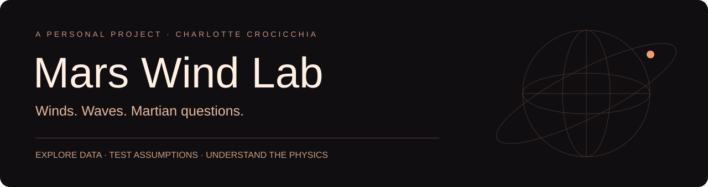
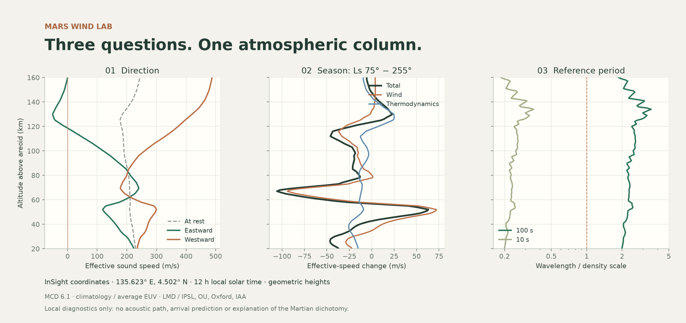

<p align="center"></p>

# Mars Wind Lab

**A personal project by Charlotte Crocicchia: exploring Mars through physical questions, reproducible calculations and understandable scientific tools.**

I started this project to build on my internship work on Martian winds and acoustics. I want to make useful, thoughtful and visually engaging tools for Martian research: start from the data, test assumptions, and make the results easier to explore.

Mars Wind Lab is part of my broader personal interest in **Mars and its hemispheric dichotomy** — the contrast between the northern lowlands and southern highlands ([NASA overview](https://science.nasa.gov/photojournal/martian-dichotomy-boundary/)). It brings together an **atmosphere and waves laboratory** and a **dichotomy evidence atlas** covering interior structure, impacts, meteorite magnetism, geological history and mission data. The research atlas helps define testable questions; the current code does not model the origin of the dichotomy or establish a causal link between winds and internal structure.

> **Status: active research prototype.** The application analyses Mars Climate Database 6.1 fields using the official sampler. Its comparisons are reproducible; full propagation and independent observational validation remain future work.

[Getting started](docs/USAGE.md) · [Scientific method](docs/SCIENTIFIC_METHOD.md) · [Validation](docs/VALIDATION.md) · [Dichotomy research](research/README.md)

## The scientific question

**Could two hemispheres record a shared ancient dynamo differently?** The [working hypothesis](research/HYPOTHESES.md) connects early crustal asymmetry to thermal evolution, magnetic acquisition and preservation. Four explicit model families separate inherited versus later recording from shared versus asymmetric ancient fields. Each states a requirement and a possible failure.

The proposed first study tests which source-depth and recording-time windows remain compatible with crustal, thermal and meteorite constraints. Its [analysis protocol](research/TEST_PROTOCOL.md) defines dependencies, physical gates and rejection rules. This is a research design grounded in published work; no joint fit or new origin mechanism is claimed. The local site separates the argument, data explorer, completed diagnostics and bibliography.

## Explore the observations and completed tests

The homepage offers three starting points: **understand the idea**, **explore the data**, and **read completed tests**. Persistent navigation keeps the library and atmosphere laboratory accessible. Maps, meteorite records, laboratory measurements and source downloads each have a separate view.

The [first observational diagnostics](research/FIRST_RESULTS.md) use **87 downloaded products**: MOLA, MGS/MAVEN magnetism, equivalent source depths, an InSight crustal-model archive, thermal outputs, the USGS geologic map, meteorite chronology/candidate sources and NWA 7034 laboratory data. The public snapshot includes 44 geologic units, 94 meteorite sample records, 16 candidate craters and 1,073 laboratory measurements. Original archives stay local; scripts and checksums make acquisition reproducible.

Two useful outcomes: the modeled south/north magnetic contrast persists at common altitudes, while inferred crustal thickness changes strongly with assumed density. A mineral-dependent thermal gate motivates testing higher-ordering-temperature carriers in deep southern sources. These are conditional diagnostics, not a unique origin or a validated remanence history. [Numerical results](research/data/results.json) · [Data conventions and licensing](research/data/README.md)

To view the committed snapshot, install the base package and run the local server; MCD is needed only for atmospheric calculations. To regenerate the observations:

```bash
python -m pip install -e '.[observations,test]'
python scripts/data/acquire.py --large
python scripts/data/build.py
```

The archive download requires several GB of disk space. Dataset licenses are separate from the code license; Herd-derived meteorite tables retain CC BY-NC 4.0.

## The dichotomy evidence atlas

Open **Library** in the app, or read the [scientific synthesis](research/SYNTHESIS.md) on GitHub. The English library contains **1,981 DOI candidates**, a **69-record core reading route**, and source notes distinguishing metadata from abstracts and selected full-text readings. It includes dedicated [meteorite magnetism](research/METEORITES.md), [mission/data](research/MISSIONS.md) and [research programme](research/RESEARCH_PLAN.md) dossiers. Download [RIS for Zotero](research/library.ris), [BibTeX](research/library.bib) or [CSV](research/catalog.csv).

This is a broad, dated inventory with selective assessment, **not an exhaustive review of every Mars paper**. Fifty-two abstracts and twelve selected full-text readings are documented; complete methodological audits and joint analysis of the newly identified mission datasets remain outstanding. [Search method and coverage](research/METHOD.md) document the query caps, 2,328 unscreened citation leads and remaining gaps. Research notes were assembled with AI assistance and need source verification before manuscript use.

## What can you use it for?

The **Atmosphere** section provides direct altitude and season sliders, seasonal/altitude playback with preparation progress, and labelled MP4 videos you can play in the page or download. The guided-experiments view offers three controlled comparisons. Each gives a numerical conclusion, an explained plot, the calculation parameters, and a useful next step.

| Question | Controlled comparison | Physical use |
|---|---|---|
| Does the wind help the wave? | The same column at rest, in one direction and its opposite | Identify layers where advection matters and a weak-wind approximation becomes questionable |
| Why does the season matter? | Two seasons at the same location and local solar time | Separate wind and thermodynamic contributions to the change in effective sound speed |
| Can we use acoustic rays? | Reference wavelength versus the vertical density scale | Examine a necessary scale-separation consideration; this diagnostic alone cannot validate ray theory |

The explorer adds a flat/globe atlas, vertical profiles, latitude–altitude sections, seasonal cycles, shear and scientific exports. A scalar modal benchmark and an optional internship-archive reader are available under **Advanced research**.



*Calculated example: 135.623° E, 4.502° N, 12 h local solar time, Ls 255° compared with 75°, climatology / average EUV. Heights are above the areoid. These are model outputs, not InSight measurements. Regenerate with `python scripts/illustrate_experiments.py` after installation.*

## Installation

This repository provides the application code. **Install MCD 6.1 and its datasets separately** through the [MCD producers](https://www-mars.lmd.jussieu.fr/mars/access.html). Cloning this repository alone does not provide the atmospheric fields. Internship archives are optional and are not distributed.

Requirements: Python ≥3.11, `gfortran`, and NetCDF C/Fortran libraries. On macOS: `brew install gcc netcdf-fortran`.

```bash
git clone https://github.com/charlottecrocicchia-netizen/mars-wind-lab.git
cd mars-wind-lab
python3 -m venv .venv
source .venv/bin/activate
python -m pip install -e '.[test]'
export MCD_ROOT="/path/to/MCD_6.1"
python scripts/build_mcd.py
python -m pytest -q
python -m uvicorn marswind.server:app --app-dir src --host 127.0.0.1 --port 8765
```

Open **http://127.0.0.1:8765**. The research overview opens first. Choose **Atmosphere** for the wind atlas. Drag **Altitude** or **Season** to update the map, or press **Play** for a complete sweep. Open **Guided experiments** to choose a physical question and click **Run experiment**. **Study note** downloads the explained result with parameters, limitations and provenance.

On an already configured Mac, double-click `Launch Mars Wind.command` to restart the local server. The application needs no cloud service or user account. Publishing this code on GitHub does not publish your local server.

`requirements-lock.txt` records the Python 3.14 environment used for local validation. Use it with Python 3.14 for exact dependency versions; otherwise install the compatible dependencies declared in `pyproject.toml`.

## Scientific conventions and scope

- Winds come from an existing GCM. This project is not a new general circulation model.
- Heights are geometric, above the areoid. Below-terrain points are masked. Raw pseudo-altitude levels are not interpreted as physical heights.
- `u` is eastward and `v` northward. Propagation azimuth is clockwise from north; projected wind is `u sin α + v cos α`.
- Thermodynamic sound speed is `c₀ = √(γRT)`, using MCD values of `γ` and `R`. Frequency-dependent molecular relaxation and dispersion are omitted.
- Guided experiments hold **local solar time** fixed. The atlas also supports a simultaneous map referenced to solar time at 0° E. These are different experiments.
- Climatology / average EUV does not reconstruct a particular event. RMS fields describe model variability, not observational confidence intervals.
- A column and its effective sound speed do not determine a source–receiver path, arrival time or SEIS detection.
- The experimental modal benchmark uses rigid walls and a first-order diagonal advective correction. It does not reproduce the internship’s global modes, acoustic losses or ground coupling.

## Reproduction and contributions

```bash
# Analytic checks; no MCD or internship archives required
python -m pytest -q -m 'not integration'
# Includes local integration checks when MCD is installed
python -m pytest -q
# Three experiment plots and local study notes
python scripts/illustrate_experiments.py
# Extended research bundle; also requires the original archives
python scripts/reproduce.py
```

Useful contributions include analytic cases, physical conventions, independent validation and clearer experiments. Include parameters and a small reproducible example when reporting an issue. Do not attach datasets that you cannot redistribute.

| Directory | Purpose |
|---|---|
| `native/` | Fortran adapter to CALL_MCD; no redistributed MCD source |
| `src/marswind/` | Sampling, physics, experiments, exports and local API |
| `web/` | English interface, local Mars backdrop, timeline player and Plotly |
| `tests/` | Analytic solutions, edge cases and optional MCD integration |
| `scripts/` | Compilation and figure reproduction |
| `docs/` | Usage, method, validation and research directions |

Caches, research outputs, machine-specific paths, MCD files and internship archives are excluded from Git. Provenance fingerprints identify queries and code. The NetCDF inventory fingerprint covers names, sizes and modification times; **it is not a hash of the full dataset contents**. See [Usage](docs/USAGE.md) for `MARS_LEGACY_ROOT` and local configuration.

## Credits and data terms

A personal project by **Charlotte Crocicchia**, developed from questions encountered during her internship. This repository is not an official product of IPGP, JPL, NASA or the MCD teams.

Atmospheric data come from the **Mars Climate Database**, developed by LMD / IPSL with the Open University, Oxford and IAA. [MCD terms](https://www-mars.lmd.jussieu.fr/mars/access.html) require attribution and keeping the producers informed of uses and developments; commercial use requires specific authorization. Publishing this application does not change those terms.

- [MCD documentation and requested references](https://www-mars.lmd.jussieu.fr/mars/info_web/index.html), including Forget et al. (1999), Millour et al. (2018), and references for the processes studied.
- [Ortiz et al. (2022), *Autocorrelation Infrasound Interferometry on Mars*](https://doi.org/10.1029/2021GL096225), for the Martian acoustics and wind context.
- [InSight TWINS / PDS](https://atmos.nmsu.edu/data_and_services/atmospheres_data/INSIGHT/retrieving_insight.html) and [SEIS](https://www.seis-insight.eu/en/59-scientifique), potential observational validation sources, not yet integrated here.

The decorative Mars backdrop is a Viking mosaic credited to NASA/JPL-Caltech; see [visual asset credits](docs/ASSETS.md). It is separate from the numerical maps.

Original application code is provided under the [MIT licence](LICENSE). Plotly.js retains its [own MIT notice](web/PLOTLY-LICENSE.txt). Neither licence applies to external MCD data, MCD software or internship archives.
