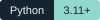
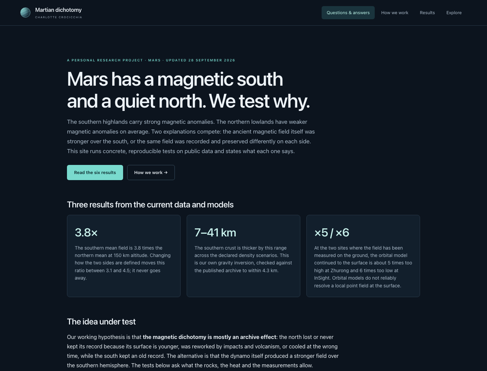
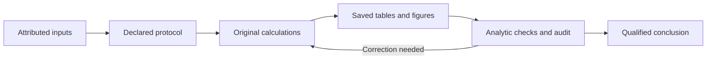
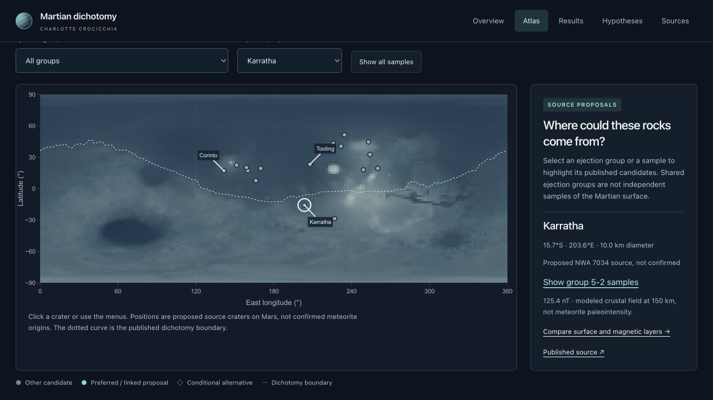

<div align="center">

# Martian Dichotomy

### Why does Mars preserve such different magnetic records in the north and south?

**Public observations · Reproducible physical tests · An interactive research atlas**

A personal research project by **Charlotte Crocicchia** · Mars Wind Lab

[](https://github.com/charlottecrocicchia-netizen/mars-wind-lab/actions/workflows/tests.yml)
[](pyproject.toml)
[](LICENSE)

[Start reading](research/STATE_OF_EVIDENCE.md) · [Explore the research](research/README.md) · [Run the website](#run-the-website) · [Reproduce the work](docs/DEVELOPMENT.md)

</div>



Mars has low northern plains, high southern terrain and a strong contrast in its crustal magnetic field. Did the ancient field differ between hemispheres, or did the rocks record and preserve it differently?

This project brings together **geology, gravity, crustal structure, thermal history, rock magnetism, paleomagnetism and meteorite chronology**. It combines an attributed literature collection, interactive maps and original numerical calculations. Each result states its assumptions, evidence and limits.

**Current snapshot · 28 September 2026:** six discriminating tests, six follow-ups and documented implementation corrections. The work constrains possible histories; it does **not** establish a unique origin of the Martian dichotomy. Scientific notes are prepared with AI assistance and internal checks, without a claim of external peer review.

## Choose your starting point

| You want to… | Start here |
| --- | --- |
| **Understand what we have learned** | [Where the evidence stands](research/STATE_OF_EVIDENCE.md) — observations, conditional results and unresolved questions |
| **Follow the scientific reasoning** | [Research guide](research/README.md) — the six tests, follow-ups and reading routes |
| **Explore maps and samples** | [Run the website](#run-the-website), then follow the [short interface guide](docs/USAGE.md) |
| **Inspect or reproduce a result** | [Development and reproduction](docs/DEVELOPMENT.md) — required inputs, commands and saved outputs |
| **Check sources or contribute** | [Source policy](docs/SOURCE_POLICY.md), [validation](docs/VALIDATION.md) and [contributing guide](CONTRIBUTING.md) |

## What the current work says

| Finding | What it means | Evidence |
| --- | --- | --- |
| The orbital magnetic contrast persists across the tested hemisphere definitions. | The contrast needs explaining; its amplitude is not directly the ancient dynamo-intensity ratio. | [Current synthesis](research/STATE_OF_EVIDENCE.md) |
| The inferred south-minus-north crustal thickness ranges from **6.6 to 41.4 km** across the declared density scenarios. | The sign is stable in those scenarios, while the size depends strongly on density. | [Six-test report](research/DISCRIMINATING_TESTS.md) |
| Slow acquisition can strongly cancel a reversing field; rapid cooling can preserve individual bodies. | Mineral properties, cooling duration, source geometry and emplacement timing must be considered together. | [Cooling and reversals](research/RAPID_BODIES.md) |
| Distinct reversal histories can produce **identical synthetic orbital fields** when acquisition clocks are free. | The declared model cannot uniquely recover reversal timing without independent constraints on acquisition. No Martian transition date is inferred. | [Identifiability test](research/REVERSAL_IDENTIFIABILITY.md) |

Some useful results are limits on the proposed tests themselves. [Arabia matching](research/ARABIA_PREFLIGHT.md) and [boundary transects](research/BOUNDARY_WALK.md) fail their spatial-support screens. [Source depth versus surface age](research/DEPTH_AGE.md) has no supported association under its declared rule. [Density and remanence](research/DENSITY_REMANENCE.md) are compatible under some material assumptions, but the calculation does not measure deep-crust mineral abundance or porosity.

The [research guide](research/README.md) keeps every question, report and output together. The [change log](CHANGELOG.md) records this snapshot, including the corrections.

## How the evidence is built


```mermaid
flowchart LR
    A[Attributed inputs] --> B[Declared protocol]
    B --> C[Original calculations]
    C --> D[Saved tables and figures]
    D --> E[Analytic checks and audit]
    E --> F[Qualified conclusion]
    E -->|Correction needed| C
```

Protocols, source ledgers and manifests accompany the calculations. Numerical checks establish implementation behavior; they do not prove a geological history. [Scientific method](docs/SCIENTIFIC_METHOD.md) explains the distinction between measurements, model outputs and interpretations.

## Run the website

**Requires Python 3.11+ and Git.** Saved reports, figures and the browsing snapshot are included. Opening the website does not rerun the scientific models or require MCD.

```bash
git clone https://github.com/charlottecrocicchia-netizen/mars-wind-lab.git
cd mars-wind-lab
python3 -m venv .venv
source .venv/bin/activate
python -m pip install -e .
python -m uvicorn marswind.server:app --app-dir src --host 127.0.0.1 --port 8765
```

Open **[http://127.0.0.1:8765](http://127.0.0.1:8765/)** in your browser. This is a local address on your own computer; GitHub hosts the repository, not a public deployment of this application. Keep the terminal open and press **Ctrl+C** to stop.

On Windows, use `py -3 -m venv .venv` and `.venv\Scripts\Activate.ps1` in PowerShell. On a configured Mac, double-click [Launch Mars Wind.command](Launch%20Mars%20Wind.command).

The four website sections are **Questions & answers → How we work → Results → Explore**. Explore contains the atlas, source catalogue, workshops and five reading dossiers.

<details>
<summary><strong>Preview the meteorite atlas</strong></summary>



The atlas links sample records, event ages, ejection groups and proposed source craters. Candidate locations remain hypotheses; members of one ejection group are not independent samples of the planet. [Records and references](research/data/meteorites.json) · [Visual credits](docs/ASSETS.md)

</details>

## Reproduce and contribute

For the local checks and page renderers:

```bash
python -m pip install -e '.[test,research,observations]'
python -m pytest -q -m 'not integration'
node --test tests/*.test.mjs
python scripts/research/render_site.py
python scripts/research/render_docs.py
```

Node.js is needed for the JavaScript checks; CI uses version 22. The [workflow](.github/workflows/tests.yml) tests Python 3.11 and 3.14. Six optional historical integration tests require a separately authorized MCD installation and are excluded from the standard run.

**Browsing, rendering and recomputing are different operations.** Full gravity, thermal and spatial builds require the permitted scientific inputs listed in [Development](docs/DEVELOPMENT.md). Large raw archives remain outside Git. A saved output or a passing unit test does not mean a fresh clone can rerun every full-data analysis without those inputs.

See [Contributing](CONTRIBUTING.md) for corrections, reproducible bug reports and scientific changes. The [roadmap](docs/ROADMAP.md) separates completed work from possible next investigations.

## Repository map

| Path | Purpose |
| --- | --- |
| [research/](research/README.md) | Research reports, protocols, source records and numerical outputs |
| [src/marswind/](src/marswind/) | Original analysis modules and the local web server |
| [scripts/](scripts/) | Numerical builders, exports and page renderers |
| [web/](web/) | Saved website, interactive tools and generated reading pages |
| [tests/](tests/) | Analytic, synthetic, provenance, navigation and browser-data checks |
| [docs/](docs/README.md) | Usage, methods, reproduction, validation and source policy |

The repository name **Mars Wind Lab** comes from an earlier atmospheric phase. The active website focuses on the dichotomy and magnetic record. Historical atmospheric modules remain documented separately; the website no longer invokes them.

## Attribution and reuse

Created by **Charlotte Crocicchia** as an independent personal research project. Project-authored code is [MIT licensed](LICENSE). External datasets and assets retain their own terms and attribution; the code license does not relicense them. See the [source policy](docs/SOURCE_POLICY.md), [data guide](research/data/README.md) and [visual credits](docs/ASSETS.md).

Use [CITATION.cff](CITATION.cff) for repository attribution, include the commit used, and cite the original scientific sources for their measurements and published methods. The literature inventory records reading depth; inclusion is not an endorsement or a completed methodological review.
