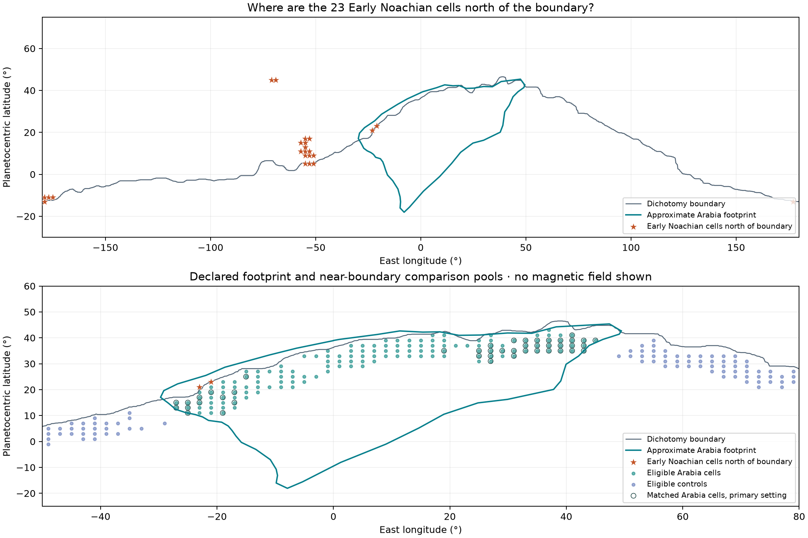

# Arabia Terra: geometry and support preflight

**Status: executed prerequisite checks; no observed magnetic outcomes used.**

## What the checks found

- All **23** northern Early Noachian cells from Test 1 were recovered; **2** fall inside the declared Arabia footprint.
- Their distances from the supplied dichotomy polyline range from **6.0 to 2279.3 km**, with a median of **207.1 km**. Counts within 50/100/160 km are **7/9/10**.
- The declared pools contain **146 Arabia cells** and **324 controls**. The primary matching retains **44 pairs**, representing **29.9%** of eligible Arabia area.
- Maximum absolute standardized covariate imbalance after matching is **0.464**, against the declared screening threshold of 0.1.



## Why this is a preflight, not a magnetic result

The analysis discards the magnetic arrays before extracting any covariate. Global associations and earlier results were already known; this is procedural non-use of outcomes for the present matching, not a historically blind discovery. It neither estimates a magnetic deficit nor decides whether the archive hypothesis is correct.

## Region and input resolution

The [USGS Gazetteer footprint](https://planetarynames.wr.usgs.gov/Feature/336), saved as `arabia_polygon.geojson`, is an approximate extent of a named feature. It is not a mapped geological contact. The detailed geometry (`wkt-25452`) on that page was selected before matching; its alternate rectangular extent was not substituted. Credit: USGS / IAU; USGS-produced numerical information is used under its [public-domain policy](https://www.usgs.gov/information-policies-and-instructions/copyrights-and-credits).

The covariates are the existing native **2° atlas**: USGS SIM 3292 geological unit, MOLA elevation, Wieczorek crustal-thickness scenarios and the Andrews-Hanna boundary distributed with that archive. The 0.5° output contains a footprint mask only. It supplies no additional geological or magnetic resolution. The approximately 160 km surface resolution of [Langlais et al. (2019)](https://doi.org/10.1029/2018JE005854) motivates dependence checks but is not a measured correlation length for this comparison.

Boundary distances use sampled great-circle segments with at most 5 km spacing (distance overestimate no more than 2.5 km from sampling). This is separate from uncertainty in the geological boundary itself. Polygon inclusion follows the supplied longitude/latitude outline; approximate edge distances use the spherical-segment convention.

## Declared comparison

Both groups are pure Noachian units south of the dichotomy boundary, within 500 km of it and between 30°S and 55°N. Controls lie outside Arabia and at least 300 km from its outline. Thus the comparison conditions on boundary side; the 23 northern cells are a separate diagnostic, not the Arabia treatment group.

Matching is without replacement and exact in epoch rank. Primary calipers are 1 km in elevation, 5 km in thickness, 150 km in boundary distance and 10° in latitude. Assignment first maximizes pair count, then minimizes squared caliper-scaled distance. The 2,600–2,900 kg/m³ atlas density scenarios and half/double calipers are declared sensitivities. Pair differences use the target cell’s area weight on both members, and balance uses the pooled unmatched standard deviation.

| Density (kg/m³) | Caliper multiplier | Pairs | Arabia area retained | Max. absolute SMD | Coverage + balance pass |
| --- | --- | --- | --- | --- | --- |
| 2600 | 0.5 | 10 | 6.7% | 0.226 | False |
| 2600 | 1 | 47 | 32.1% | 0.528 | False |
| 2600 | 2 | 90 | 62.5% | 1.126 | False |
| 2700 | 0.5 | 10 | 6.7% | 0.226 | False |
| 2700 | 1 | 47 | 32.1% | 0.528 | False |
| 2700 | 2 | 90 | 62.4% | 1.125 | False |
| 2800 | 0.5 | 9 | 5.9% | 0.213 | False |
| 2800 | 1 | 46 | 31.4% | 0.491 | False |
| 2800 | 2 | 88 | 61.0% | 1.098 | False |
| 2900 | 0.5 | 9 | 6.0% | 0.196 | False |
| 2900 | 1 | 44 | 29.9% | 0.464 | False |
| 2900 | 2 | 80 | 55.1% | 0.989 | False |

The 50% area-coverage and 0.1 imbalance thresholds are declared feasibility screens, not universal statistical criteria. Changing a caliper changes which population can be compared. All twelve declared variants fail at least one of these screens. This finding concerns the chosen pools and matching design; it does not prove that every possible Arabia comparison is infeasible.

## Can the blocks be exchanged?

A block shared by several pairs couples those pairs. Connecting all pairs through shared target or control blocks reveals the candidate joint sign-flip units. This diagnoses one source of dependence; components are not automatically independent, and swapping regional labels is not justified merely by matching measured covariates.

| Nominal block size (km) | Grid offset | Target/control blocks | Connected components | Largest component (pairs) | Closest components (km) | Geometry screen |
| --- | --- | --- | --- | --- | --- | --- |
| 300 | 0 | 17/16 | 3 | 32 | 164.1 | False |
| 300 | 0.5 | 14/18 | 6 | 31 | 117.4 | False |
| 600 | 0 | 9/10 | 2 | 32 | 371.5 | False |
| 600 | 0.5 | 9/10 | 2 | 32 | 371.5 | False |
| 900 | 0 | 7/7 | 2 | 32 | 371.5 | False |
| 900 | 0.5 | 7/9 | 3 | 31 | 160.2 | False |

The declared geometry screen asks for at least eight components and 160 km between sampled cells in different components. It does not prove exchangeability, stationarity, identical noise or independence of the underlying source footprints. The scientific target is still spatially structured and regional covariates remain unmeasured.

**No permutation p-value is reported.** The primary overlap and block screens are reported above. A supported design and synthetic-null calibration are required before an observed-field test. Naively treating grid cells or pairs sharing a block as independent would inflate the apparent sample size.

## Reproduce and inspect

```bash
python scripts/followup/arabia_preflight.py
python -m pytest -q tests/test_spatial_matching.py
```

The run is offline and writes only this follow-up directory and its report. Its inputs, protocol, numerical source code and outputs are hashed in [the manifest](followup/arabia/manifest.json). Source attribution and reuse terms for the existing atlas remain in [the input manifest](data/manifest.json). The six-test outputs are not rebuilt or overwritten.

- [Frozen preflight protocol](followup/arabia/protocol.json)
- [23 northern-cell coordinates](followup/arabia/northern_early_noachian_cells.csv)
- [Covariates and eligibility masks](followup/arabia/covariates_and_masks.csv)
- [Matching diagnostics](followup/arabia/matching_diagnostics.csv)
- [Matched pairs](followup/arabia/matched_pairs.csv)
- [All block diagnostics](followup/arabia/block_diagnostics.csv)
- [Pair/block allocation ledger](followup/arabia/pair_block_allocations.csv)
- [Polygon GeoJSON](followup/arabia/arabia_polygon.geojson)
- [Geometry-only 0.5° mask](followup/arabia/geometry_mask_0p5.npz)
- [Machine-readable summary](followup/arabia/summary.json)
