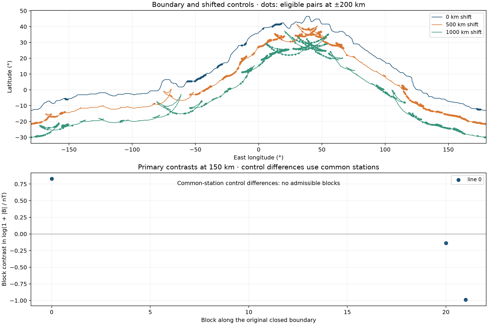

# Boundary transects and the 23 northern cells

**Status: calculation completed; insufficient spatial support for the declared inference.** The numerical contrasts below are descriptive. They neither validate an archive explanation nor establish a difference in the ancient field.

## Why

The proposed comparison asks whether the magnetic amplitude changes across the dichotomy boundary when both sampled surfaces are Noachian, and whether that change exceeds changes across two lines displaced into the south. Pairing across a line supplies a geometric correspondence; it does not guarantee enough old terrain, balance in crustal properties, or independent spatial blocks.

## How

The [protocol](followup/boundary_walk/protocol.json) was declared locally on 2026-09-28, before this calculation's geology selection and magnetic evaluation. Earlier project results were already known; this was not a historically blind or externally preregistered discovery. The geometry and null-gate records precede the field evaluation in the saved run.

We retain all **1,466 distinct vertices** of the supplied Andrews-Hanna polyline; its 1,467th row repeats the first. Great-circle segments give a length of **24,043 km**. Each station represents half its preceding and following segment lengths, so dense vertices do not automatically receive greater aggregate weight. Tangents use points 100 km before and after each station; spherical normals determine paired locations at ±200, ±400 and ±600 km. The primary distance is ±200 km. The field is evaluated directly from degree-134 Langlais coefficients at 150 km above the model's 3,393.5 km reference sphere; 400 km is a sensitivity. Geodesic distances use a 3,389.5 km sphere.

Geology comes from direct point inclusion in authorized USGS SIM 3292 polygons. Ambiguous or unassigned points and mixed-period units are excluded. The main selection requires both endpoints to be pure Noachian; this can still pair different Noachian epochs. A stricter sensitivity requires equal epoch rank. Undivided Noachian and Middle Noachian share the pre-existing rank 2 convention, so this is still not an exact age match. Boundary side is checked against a 0.25° mask. Neither sampling interval adds observational resolution.

Control lines shift stations 500 and 1,000 km along the original southern normal, then recompute their own tangents. Each control's center and both endpoints must be south of the original boundary and Noachian. Both displaced lines fold in the longitude–latitude diagnostic. Their local normals and overlapping source footprints therefore require caution; these are not automatically interchangeable realizations of a null boundary.

The observable is **Δ = log(1 + |B south| / 1 nT) − log(1 + |B north| / 1 nT)**. Positive values mean stronger modeled amplitude on the southern endpoint. The original curve is tiled by 24 blocks of about 1001.8 km. A block must contain at least 200 km of eligible station weights. The main statistic weights stations by represented arc within each retained block, then weights the block means equally. Blocks shifted by half a block are a declared sensitivity. The true-minus-control contrasts use the **intersection of eligible stations on all three lines**.

## Result

At ±200 km the true line has **120 eligible pairs**, representing 1834 km of station weights, but only **3 adequately covered blocks**. Those blocks actually contain 92 pairs and 1400 km of weights. Requiring equal Noachian epoch rank reduces the true-line selection to 69 pairs and one retained block.

| Comparison at 150 km, ±200 km | Eligible pairs | Retained blocks | Equal-block mean Δ | All-eligible arc mean Δ |
| --- | ---: | ---: | ---: | ---: |
| True boundary | 120 | 3 | -0.099 | -0.205 |
| Shifted 500 km | 646 | 16 | 0.285 | 0.355 |
| Shifted 1,000 km | 658 | 15 | -0.070 | -0.183 |
| True minus 500 km, common stations | 29 | 0 | Not estimable | -0.551 |
| True minus 1,000 km, common stations | 29 | 0 | Not estimable | -0.147 |

The two stand-alone control means use much broader geographical support than the true-line mean. Comparing those three means directly would not test boundary specificity. On common support, only **29 stations** remain, with **399 km** of eligible station weights scattered across blocks. None of those blocks passes the declared 200 km coverage threshold. The arc-weighted control differences are reported for inspection, but the primary block comparison is not estimable.



[Download the figure as SVG](followup/boundary_walk/boundary_walk.svg). Dots on the map mark centers with eligible ±200 km pairs; they are not individual spacecraft observations. No control-difference points appear in the lower panel because no common-support block qualifies.

### Sensitivity to distance, epoch and altitude

| Altitude (km) | Age selection | Distance each side (km) | True-line pairs | Retained blocks | Equal-block mean Δ |
| --- | --- | ---: | ---: | ---: | ---: |
| 150 | Both Noachian | ±200 | 120 | 3 | -0.099 |
| 150 | Both Noachian | ±400 | 16 | 1 | 0.605 |
| 150 | Both Noachian | ±600 | 30 | 1 | 1.420 |
| 150 | Same epoch rank | ±200 | 69 | 1 | 0.095 |
| 150 | Same epoch rank | ±400 | 5 | 0 | Not estimable |
| 150 | Same epoch rank | ±600 | 1 | 0 | Not estimable |
| 400 | Both Noachian | ±200 | 120 | 3 | -0.392 |
| 400 | Both Noachian | ±400 | 16 | 1 | 0.601 |
| 400 | Both Noachian | ±600 | 30 | 1 | 1.115 |
| 400 | Same epoch rank | ±200 | 69 | 1 | 0.038 |
| 400 | Same epoch rank | ±400 | 5 | 0 | Not estimable |
| 400 | Same epoch rank | ±600 | 1 | 0 | Not estimable |

Changing distance changes the geographical population and can change the sign. These rows are not repeated estimates of one global effect. A half-block displacement leaves four main-selection blocks instead of three at ±200 km, with Δ = −0.109; the common-support comparison still has zero admissible blocks. These declared sensitivities do not repair the inferential support.

## Verdict

**Not decisive.** The small supported subset has no uniform positive step: its three primary block contrasts are approximately +0.828, −0.137 and −0.989. This does not establish absence of a step along the whole boundary. The common-support negative-control comparison cannot be estimated under the frozen block rule. Consequently, this design neither requires a hemispheric field difference nor demonstrates that preservation alone suffices.

The protocol requires at least eight supported blocks before synthetic calibration. All three primary cases fail that prerequisite (3, 0 and 0 blocks), so the spatial Gaussian null simulations were **not run for those cases**. The saved [null-gate record](followup/boundary_walk/synthetic_null.json) states this explicitly. Unit checks separately confirm that the implementation detects invalid independent sign flips when all blocks share the same signal.

The CSV includes `reference_sign_flip_tail` as a computational diagnostic under independent block-sign invariance. It is **not a calibrated scientific p-value**. This distinction also applies to small tail fractions on a displaced line: that line was outside the primary calibration scope, has different support, and folds. A nominal 1,000 km block label does not establish the required joint symmetry. This follows the exchangeability and sign-flipping requirements described by [Winkler et al. (2014)](https://pmc.ncbi.nlm.nih.gov/articles/PMC4010955/).

## Regional decomposition of the 23 cells

This auxiliary calculation retains the exact old atlas cells and area weights. The four geographical boxes were declared from the proposed groups; they are descriptive labels rather than independently mapped provinces. All fields here are at 150 km. Both kinds of mean use cosine-latitude area weights. The share column decomposes the total weighted log(1 + |B| / 1 nT), not magnetic energy or a linear source contribution.

| Region | Cells | Arithmetic mean (nT) | Back-transformed log mean (nT) | Share of weighted log total | Distance proxy min / median (km) |
| --- | ---: | ---: | ---: | ---: | ---: |
| Xanthe–Chryse | 14 | 78.9 | 63.3 | 65.6% | 236 / 544 |
| Cimmeria margin | 5 | 57.2 | 50.3 | 22.1% | 118 / 166 |
| Arabia margin | 2 | 79.8 | 79.8 | 9.4% | 246 / 325 |
| Tempe | 2 | 5.1 | 5.1 | 2.9% | 2625 / 2648 |
| All 23 | 23 | 69.3 | 52.5 | 100.0% | 118 / 424 |

The original Test 1 statistic is **52.5 nT after back-transforming the mean logarithm**, while the arithmetic mean is **69.3 nT**. Xanthe–Chryse supplies 14 of the 23 cells and 65.6% of the weighted logarithmic total; adding Cimmeria raises this share to 87.7%. The aggregate similarity with southern Early Noachian terrain therefore does not establish a representative northern equivalence.

The distance proxy is the great-circle distance to the nearest **southern 2° atlas cell center with |B| ≥ 100 nT at 150 km**. For Cimmeria its minimum is 118 km and median 166 km. This thresholded coarse-grid proxy neither verifies nor rules out a physical anomaly within 100 km. An orbital field contains contributions from neighboring sources, but these distances cannot establish that the five cells are contaminated by southern sources. Source separation would need its own forward model and uncertainty analysis. The [individual-cell export](followup/boundary_walk/regional_23_cells.csv) and [regional summary](followup/boundary_walk/regional_23_summary.csv) include both 150 and 400 km.

## Limits and source provenance

Noachian surface classification does not control magnetic acquisition time, buried lithology, source depth, thermal alteration or lateral field contributions. This is a comparison of one published magnetic model, without a propagated coefficient covariance or spacecraft-error model. The degree-134 model's reported roughly 160 km surface resolution is not a measured correlation length; upward continuation further smooths the signal. See [Langlais et al. (2019)](https://doi.org/10.1029/2018JE005854). The two shifted curves and the stricter age selection do not turn this study into a causal experiment.

Inputs reuse the already authorized project copies: the boundary from the [Wieczorek et al. (2022) crustal archive](https://doi.org/10.1029/2022JE007298), geological units from [Tanaka et al. (2014), USGS SIM 3292](https://doi.org/10.3133/sim3292), Langlais model coefficients, and the existing atlas and 23-cell ledger. Their original attributions and reuse terms remain in the project's source policy and atlas manifest. No new external dataset, article figure or third-party implementation was incorporated. The frozen input bundle also fingerprints MOLA, but this calculation does not use elevation as a covariate.

Reading depth: existing archive documentation and numerical files; the Langlais indexed abstract/model-resolution description; and selected Winkler method passages on exchangeability and sign symmetry. This is not a full literature review or an established novelty claim. These scripts and the checks are an internal implementation review, not independent peer review. The previous [Arabia preflight](ARABIA_PREFLIGHT.md) and its numerical outputs remain unchanged.

## Reproduce

Run from the repository root with the permitted source files and scientific environment installed:

```bash
python scripts/followup/boundary_walk.py
python scripts/followup/render_boundary_walk.py
python -m pytest -q tests/test_boundary_walk.py
python scripts/research/render_site.py
python scripts/research/render_docs.py
```

The builder validates input hashes, writes geometry and the calibration decision before evaluating the observed field, and saves 120 contrast configurations. The report renderer only reads these outputs. [Run manifest](followup/boundary_walk/manifest.json), [geometry ledger](followup/boundary_walk/geometry_and_eligibility.csv), [all contrasts](followup/boundary_walk/contrasts.csv), [block contrasts](followup/boundary_walk/block_contrasts.csv), [selected field values](followup/boundary_walk/selected_field_values.csv) and [summary](followup/boundary_walk/summary.json) allow the result to be inspected. Timestamps and hashes identify a saved local run; they do not provide independent proof of preregistration.
