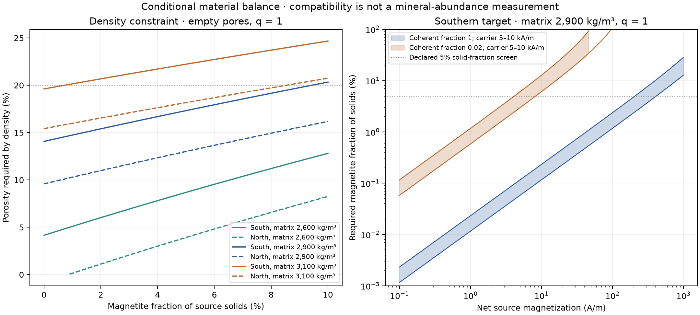

# Density and remanence in one material model

**Status: executed conditional mixture calculation. Verdict: adds a constraint; low density does not by itself exclude strong remanence.**

The declared grid contains 21,600 exact density–magnetization solutions, 4,500 material-cap intervals and 144 illustrations using previous source scenarios. These are combinations of assumptions, not independent observations or probabilities for Mars.

## Why

A dense magnetic carrier can increase crustal density, but its required abundance depends on remanence per unit mineral volume, directional coherence and pore space. Several A/m does not automatically require several percent magnetite. This follow-up puts these quantities in the same mass and remanence balance.

The density scenarios are **2,622 ± 42 kg/m³ north and 2,492 ± 36 kg/m³ south**, from the [NASA PGDA producer summary for Goossens & Sabaka (2026)](https://pgda.gsfc.nasa.gov/products/102). The published [article](https://doi.org/10.1029/2026GL122393) and [dataset](https://doi.org/10.60903/GSFCPGDA-MARS-RMS) concern a gravity–topography boundary constraint. These values are not measured densities at the locations and depths of each magnetic source. Their full covariance and depth sensitivity have not been reproduced here.

## How

Let `f` be the magnetite fraction of the **solid source volume**, `phi` porosity, `q` the source fraction of the larger density-averaging volume, and `c` retained directional coherence. The surrounding material has the same nonmagnetic matrix and porosity. Then:

```text
rho_average = (1 - phi) * [rho_matrix + q*f*(rho_mag - rho_matrix)] + phi*rho_pore
M_source    = (1 - phi) * f * M_carrier * c
M_average   = q * M_source
```

The primary illustration assumes `q = 1`, an empty pore space, matrix density 2,900 kg/m³ and magnetite density 5,180 kg/m³. The latter is an isolated mineral-property reference from the [AIST-hosted table](https://staff.aist.go.jp/r-morijiri/research/research_pmag/pmag01.html). Matrix densities 2,400–3,100 kg/m³, pore densities 0 and 1,000 kg/m³, and `q = 0.25, 0.5, 1` are declared sensitivities. A volume-weighted density is bookkeeping, not the gravity measurement's actual spatial kernel.

For the carrier, [Dunlop & Arkani-Hamed (2005), Table 3 and section 5.3](https://agupubs.onlinelibrary.wiley.com/doi/full/10.1029/2005JE002404), give **5–10 kA/m thermoremanence for single-domain magnetite acquired in 50 µT**. We use that domain-state scenario, not the 480 kA/m saturation magnetization. It is not a calibrated measurement of the Martian deep crust. A 5 µT case uses an explicitly assumed linear field scaling; preservation efficiencies 0.1 and 1, and coherent fractions 0.02, 0.1 and 1, expose further uncertainty. The underlying experimental papers were not reanalyzed.

For each target, `b = M_source/(M_carrier*c)` is the carrier fraction of the **bulk source volume**. The equations have the exact solution:

```text
phi = [rho_matrix + q*b*(rho_mag - rho_matrix) - rho_average] / (rho_matrix - rho_pore)
f   = b / (1 - phi)
```

Unphysical candidates remain flagged rather than clipped into agreement. We also solve the attainable interval exactly under porosity caps 0, 5, 10, 20 and 30%, and solid-carrier caps 1, 5 and 10%. These are scenario screens, not measured geological bounds. Tests compare the analytic interval with an independent linear-program solver. The [protocol](followup/mixture/protocol.json) was saved before this mixture calculation; the prior project results and literature values were already known. It is a local declaration, not external preregistration.

## Result

### The low density already constrains the nonmagnetic matrix

For an empty-pore matrix of 2,900 kg/m³ with **no magnetite**, reaching the central density target requires **14.07% porosity south and 9.59% north**. The southern value falls to 4.15% if the matrix is 2,600 kg/m³, or rises to 19.61% for 3,100 kg/m³. A 2,400 kg/m³ matrix cannot reach 2,492 kg/m³ by adding empty pores alone; it would require a denser component. These examples show the composition–porosity ambiguity before magnetization is imposed.

### Previous source scenarios, under the same-volume assumption

The following targets are the saved median requirements of Test 3's centered 20 km cylinder. The corrected rows already incorporate the previous Poisson-reversal penalty for mean chrons of 0.67 Myr. **They use `c = 1` here**, so cancellation is not applied twice. All rows assume matrix density 2,900 kg/m³, empty pores, `q = 1`, and the central density for that hemisphere.

| Target scenario | Required M (A/m) | Carrier TRM (kA/m) | Magnetite, solid volume | Required porosity | Density increment at fixed porosity (kg/m³) |
| --- | ---: | ---: | ---: | ---: | ---: |
| North · Coherent cylinder | 1.01 | 5 | 0.022% | 9.60% | 0.46 |
| North · Coherent cylinder | 1.01 | 10 | 0.011% | 9.59% | 0.23 |
| North · After Poisson correction | 39.75 | 5 | 0.885% | 10.21% | 18.13 |
| North · After Poisson correction | 39.75 | 10 | 0.441% | 9.90% | 9.06 |
| South · Coherent cylinder | 4.21 | 5 | 0.098% | 14.14% | 1.92 |
| South · Coherent cylinder | 4.21 | 10 | 0.049% | 14.10% | 0.96 |
| South · After Poisson correction | 207.92 | 5 | 5.031% | 17.34% | 94.81 |
| South · After Poisson correction | 207.92 | 10 | 2.467% | 15.70% | 47.41 |

For the southern coherent target, **4.21 A/m**, efficient recording needs only **0.049–0.098% magnetite by solid volume**. Its density increment relative to the same porous matrix without carrier is **0.96–1.92 kg/m³**. Thus the earlier implication that a few A/m necessarily requires several percent magnetite is unsupported.

For the **207.92 A/m** southern target after the saved cancellation correction, the fraction rises to **2.47–5.03%**, with **15.70–17.34% porosity**. The lower carrier-efficiency endpoint slightly exceeds the declared 5% solid-fraction screen, while the higher endpoint passes it. Neither endpoint is a geological probability or an inferred Martian abundance. The 10th and 90th percentile targets, and the other declared cylinder geometries, remain in the [scenario export](followup/mixture/prior_test_scenarios.csv).



[Vector figure](followup/mixture/mixture.svg). Left: the density relation for three matrices. Right: required fractions at the southern density, with carrier remanence varied across 5–10 kA/m. Values beyond the dotted screens are shown to expose the trade-off; being plotted does not establish admissibility under a cap or survival of that porosity at depth.

### What a stated porosity cap permits

With no more than 5% magnetite in the solids, matrix density 2,900 kg/m³, empty pores, `q = 1`, full coherence and carrier remanence 5–10 kA/m:

| Density target | Porosity cap | Maximum source M across the carrier range (A/m) |
| --- | ---: | ---: |
| North | 10% | 26.3–52.6 |
| North | 20% | 217.5–435.0 |
| North | 30% | 217.5–435.0 |
| South | 10% | No density-compatible mixture |
| South | 20% | 206.7–413.4 |
| South | 30% | 206.7–413.4 |

Where a mixture exists in this table its attainable interval begins at zero. A 10% porosity cap cannot reach the southern density even without a magnetic requirement; that is a failure of the selected matrix–porosity combination, not evidence against magnetization. When coherence falls to 0.02 the same magnetic capacities are multiplied by 0.02. A 5 µT field or preservation efficiency 0.1 each supplies another factor of 0.1 under the declared scaling. The [full interval export](followup/mixture/attainable_intervals.csv) factors out carrier remanence and coherence and also reports nonzero lower bounds where required by density.

### A local source need not fill the density-averaging volume

The same southern target of 207.92 A/m gives the following conditional results when it occupies a fraction `q` of that volume. The matrix and porosity are shared with the background:

| Source fraction q | Carrier TRM (kA/m) | Source magnetite, solid volume | Porosity | Average density increment (kg/m³) |
| --- | ---: | ---: | ---: | ---: |
| 0.25 | 5 | 4.886% | 14.89% | 23.70 |
| 0.5 | 5 | 4.933% | 15.70% | 47.41 |
| 1 | 5 | 5.031% | 17.34% | 94.81 |
| 0.25 | 10 | 2.431% | 14.48% | 11.85 |
| 0.5 | 10 | 2.443% | 14.89% | 23.70 |
| 1 | 10 | 2.467% | 15.70% | 47.41 |

Diluting the source volume reduces the mean density contribution. These cases do not assert a measured layer thickness or spatial filling fraction. The source magnetization stays local; it must not be compared to the average magnetization without the additional factor `q`.

Density offsets of ±1 and ±2 times each published quoted error are evaluated deterministically in the grid. They are not sampled as Gaussian errors or interpreted as joint confidence regions. No fraction of passing parameter combinations is reported as a probability.

## Verdict and limits

**Adds a constraint.** A low-density southern crust and magnetized sources can coexist algebraically within declared material scenarios. The density comparison does not by itself reject either the coherent or the cancellation-corrected median source requirement. Compatibility depends strongly on remanence efficiency, coherence, matrix density, porosity and the volume correspondence. Density alone provides no unique mineral abundance or universally applicable magnetization ceiling.

The adopted porosities are not independently established for the deep magnetic source. A physically viable geological history would also have to explain their survival, the mineral grain state and chemistry, thermal stability, source geometry and vector cancellation. Alternative carriers and matrix remanence are omitted. This calculation does not rerun the gravity inversion or its covariance and does not promote a local cylinder target into a hemispheric measurement.

Compositional control of Martian magnetism is established prior work; [AlHantoobi et al. (2021)](https://doi.org/10.1029/2020GL090379) also distinguishes the depths sampled by surface spectroscopy and by magnetic anomalies. Selected text was consulted; its supporting material and full calibration were not reproduced. No novelty claim is made. The [source ledger](followup/mixture/sources.json) records the reading depth and reuse scope.

## What the surface follow-ups actually established

The [Arabia preflight](ARABIA_PREFLIGHT.md) and [boundary transects](BOUNDARY_WALK.md) lack support for their declared comparisons. The boundary calculation used direct polygon inclusion and direct magnetic coefficients, not a 2° magnetic interpolation. The [depth–age result](DEPTH_AGE.md) does not show a stable association under its chosen sensitivities. These findings justify pausing repetition of the same designs, not declaring geological surface information universally exhausted.

An audit of the saved depth–age table gives **8 positive northern cases out of 12**, not 10; changing wedge offset repeats the same point correlation and changes only the bootstrap interval. The 38 km median in the oldest northern bin describes **one window**; the 30 km bin contains nine. Correlating all lower or all upper uncertainty endpoints is a sensitivity exercise, not a joint posterior for the unknown depths. A null or unstable association neither confirms excavation nor excludes resurfacing, whose distinct removal, burial and heating histories need not all predict the same depth trend. The primary numerical outputs are preserved.

Rapidly cooled bodies remain a useful next model, alongside different reversal histories, recording episodes, carrier efficiencies and source geometries. The present calculations have not established that rapid cooling is the only remaining route.

## Reproduce

```bash
python scripts/followup/mixture.py
python scripts/followup/render_mixture.py
python -m pytest -q tests/test_mixture.py
python scripts/research/render_site.py
python scripts/research/render_docs.py
```

The numerical builder verifies the frozen input hashes and writes original project-generated tables and figures. The report renderer reuses those results. [Manifest](followup/mixture/manifest.json), [inverse grid](followup/mixture/inverse_grid.csv), [attainable intervals](followup/mixture/attainable_intervals.csv), [zero-carrier baselines](followup/mixture/zero_carrier_baseline.csv), [prior-test scenarios](followup/mixture/prior_test_scenarios.csv) and [summary](followup/mixture/summary.json) are inspectable. Validation covers mass balance, physical endpoints, unit conversion, volume averaging, cancellation applied once, and agreement with independent linear optimization. This remains an internal numerical check, not external scientific review.
