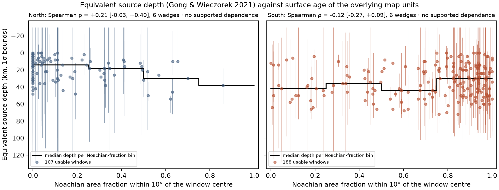

# Source depth against surface age

**Status: calculation completed · 295 usable source-depth windows (107 north, 188 south).** [Protocol](followup/depth_age/protocol.json) · [Per-window table](followup/depth_age/windows.csv) · [All correlations](followup/depth_age/correlations.csv) · [Manifest](followup/depth_age/manifest.json)

## Why

Gong & Wieczorek (2021) report equivalent source depths of about 9 km in the north and 32 km in the south and read this as excavation of northern material by the Borealis impact. A resurfacing-archive explanation of the weak north makes a different prediction: where young surfaces removed, buried or reheated the shallow record, the surviving northern sources should be deeper, so depth should increase as the Noachian fraction of the overlying surface decreases. The prediction and the decision rule were written into the protocol before any depth or field value was read.

## How

For each usable window (nonnegative best fit with published 1σ bounds) the area-weighted Noachian fraction and mean epoch rank of the USGS SIM 3292 units are computed within 10° and 20° of the window centre on the 2° atlas. Windows with more than 25% unassigned area are dropped. The rank correlation between depth (best fit, lower and upper 1σ bound) and each surface summary is computed per hemisphere. Because windows are 10° apart with 20° radii, the interval comes from a block bootstrap over six 60° longitude wedges (offsets 0° and 30°), 2,000 draws. Twelve cases per hemisphere and covariate; an association is reported only if all twelve share a sign and the primary interval excludes zero.

## Result

| Hemisphere | Primary ρ (depth vs Noachian fraction, 10°, best depth) | 5–95% block interval | Wedges | Sign consistent across 12 cases | Verdict |
| --- | ---: | --- | ---: | --- | --- |
| North | +0.21 | [-0.03, +0.40] | 6 | False | no supported dependence |
| South | -0.12 | [-0.27, +0.09] | 6 | False | no supported dependence |

Median equivalent depth by Noachian fraction within 10°:

| North: Noachian fraction | Windows | Median depth (km) | Mean depth (km) |
| --- | ---: | ---: | ---: |
| 0.00–0.25 | 80 | 14 | 17 |
| 0.25–0.50 | 17 | 18 | 19 |
| 0.50–0.75 | 9 | 30 | 31 |
| 0.75–1.00 | 1 | 38 | 38 |

| South: Noachian fraction | Windows | Median depth (km) | Mean depth (km) |
| --- | ---: | ---: | ---: |
| 0.00–0.25 | 23 | 42 | 39 |
| 0.25–0.50 | 21 | 36 | 37 |
| 0.50–0.75 | 31 | 44 | 37 |
| 0.75–1.00 | 113 | 30 | 31 |

All declared cases at offset 0° (offset 30° is in the CSV):

| North | Radius | Depth variant | Windows | ρ | 5–95% |
| --- | --- | --- | ---: | ---: | --- |
| noachian fraction | 10° | best | 107 | +0.21 | [-0.03, +0.40] |
| noachian fraction | 10° | lower 1sigma | 107 | +0.25 | [+0.11, +0.53] |
| noachian fraction | 10° | upper 1sigma | 107 | -0.23 | [-0.36, -0.09] |
| mean rank | 10° | best | 107 | -0.20 | [-0.39, +0.07] |
| mean rank | 10° | lower 1sigma | 107 | -0.16 | [-0.41, -0.02] |
| mean rank | 10° | upper 1sigma | 107 | +0.23 | [+0.05, +0.44] |
| noachian fraction | 20° | best | 107 | +0.18 | [-0.09, +0.42] |
| noachian fraction | 20° | lower 1sigma | 107 | +0.36 | [+0.22, +0.61] |
| noachian fraction | 20° | upper 1sigma | 107 | -0.34 | [-0.50, -0.16] |
| mean rank | 20° | best | 107 | -0.20 | [-0.38, +0.03] |
| mean rank | 20° | lower 1sigma | 107 | -0.20 | [-0.50, -0.03] |
| mean rank | 20° | upper 1sigma | 107 | +0.27 | [+0.07, +0.50] |

| South | Radius | Depth variant | Windows | ρ | 5–95% |
| --- | --- | --- | ---: | ---: | --- |
| noachian fraction | 10° | best | 188 | -0.12 | [-0.27, +0.09] |
| noachian fraction | 10° | lower 1sigma | 188 | +0.09 | [-0.04, +0.26] |
| noachian fraction | 10° | upper 1sigma | 188 | -0.18 | [-0.36, +0.06] |
| mean rank | 10° | best | 188 | +0.16 | [-0.07, +0.34] |
| mean rank | 10° | lower 1sigma | 188 | -0.14 | [-0.31, +0.03] |
| mean rank | 10° | upper 1sigma | 188 | +0.28 | [+0.04, +0.44] |
| noachian fraction | 20° | best | 188 | -0.07 | [-0.29, +0.16] |
| noachian fraction | 20° | lower 1sigma | 188 | +0.07 | [-0.11, +0.28] |
| noachian fraction | 20° | upper 1sigma | 188 | -0.10 | [-0.28, +0.10] |
| mean rank | 20° | best | 188 | +0.11 | [-0.16, +0.35] |
| mean rank | 20° | lower 1sigma | 188 | -0.14 | [-0.34, +0.03] |
| mean rank | 20° | upper 1sigma | 188 | +0.21 | [-0.03, +0.40] |

For context, depth against log RMS field at 150 km: north ρ = -0.04 [-0.43, +0.40], south ρ = +0.14 [-0.05, +0.35]. Gong & Wieczorek's statement that the strongest anomalies are associated with deep sources can be checked against these values.



## Reading

The verdict follows the declared rule. A reported association would mean that, within one hemisphere, windows over younger surfaces have systematically different equivalent depths; it would not date the sources, identify a mechanism, or separate resurfacing from lateral variations in crustal structure. No supported dependence would mean that this dataset cannot distinguish the two declared predictions at the 60° wedge scale. Six wedges is a coarse resampling unit; the intervals are correspondingly wide and should be read as such.

## Limits

Equivalent thin-layer depths are model quantities from one field model, with 1σ bounds that often span tens of kilometres. The 2° map units summarise surface age coarsely and mixed-period units are averaged. Windows overlap heavily; the wedge bootstrap addresses one scale of dependence only. No p-value is computed.

## Reproduce

```bash
python scripts/followup/depth_age.py
python -m pytest -q tests/test_depth_age.py
python scripts/research/render_docs.py
```
