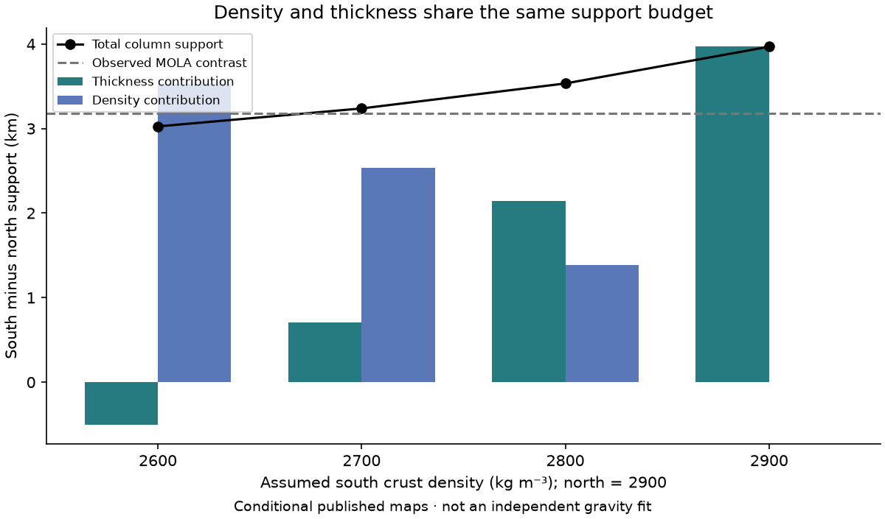
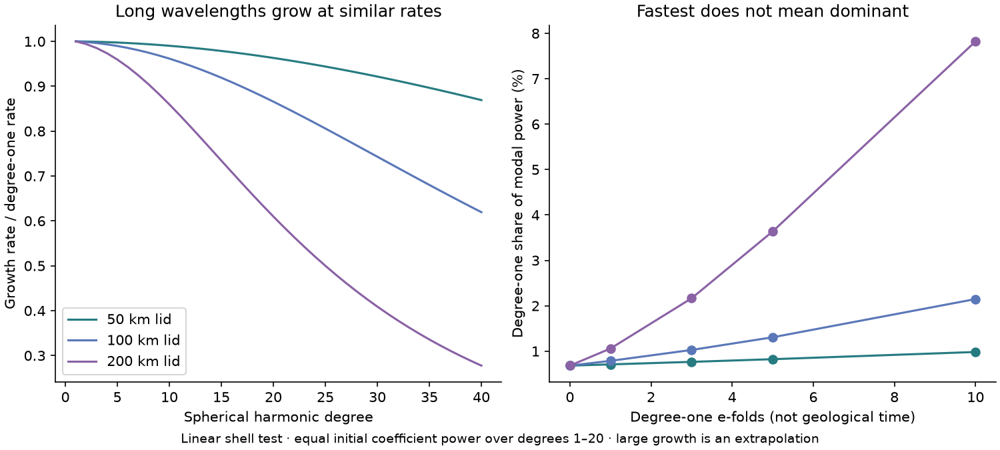
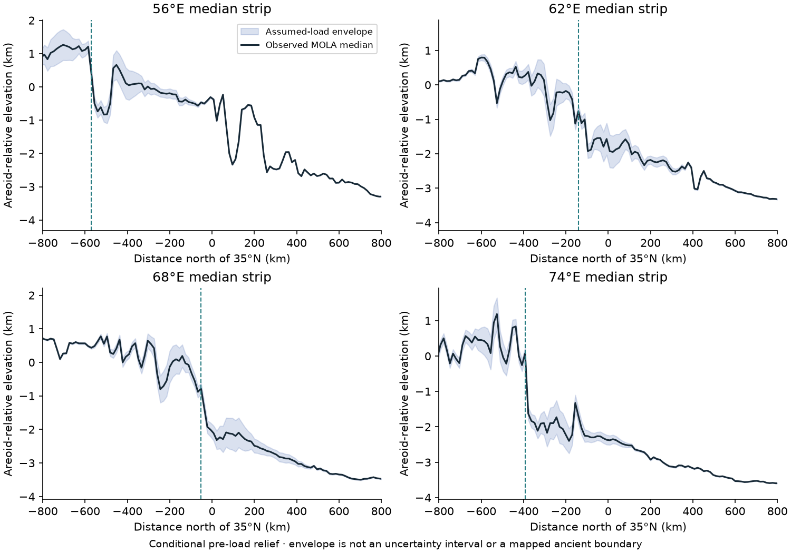

# Three physical tests of the Martian dichotomy

Executed 27 September 2026. [Open the interactive workbench](DICHOTOMY_PHYSICS.md) · [Learn the magnetic methods](PALEOMAGNETISM_FOUNDATIONS.md).

We implemented three bounded calculations from published ideas and permitted inputs. They expose what an explanation must account for. **They do not identify the origin of the dichotomy, recover a dated ancient boundary, or establish a new discovery.** Differentiation, thermal amplification and flexural deformation already have substantial published prior art.

| Question | Calculation completed | What the result changes |
| --- | --- | --- |
| Can composition help support the highlands? | Density–thickness accounting for four published crust models; 180 layered-column cases | Thickness contrast alone cannot separate extra crust from lighter crust. |
| Can a small initial difference grow into two hemispheres? | Spherical conductive-shell response at degrees 1–40; initial-spectrum sensitivity | A slightly faster hemispheric mode need not dominate within the linear regime. |
| Can later deformation hide an earlier boundary? | Conditional elastic unloading of four actual MOLA profiles | The picked steepest slope can switch features; apparent motion is not automatically geological motion. |

These are calculations of hydrostatic support, linear thermal response and elastic deformation. We have not yet coupled thermodynamic melting, evolving convection, fault slip or magnetic acquisition into a validated planetary evolution model.

## 1. Composition, density and buoyancy

### Source idea and independent implementation

The existing [Wieczorek et al. (2022)](https://doi.org/10.1029/2022JE007298) archive supplies four density-conditioned crustal thickness maps. The northern crust density is 2,900 kg/m³; southern density varies from 2,600 to 2,900 kg/m³. We use the already permitted 2° summaries, the full archived dichotomy polygon, and cosine-area weighting. The maps incorporate topography in their construction: agreement with relief is **not independent validation**.

For a fully compensated column with thickness H, mean crust density ρc and constant mantle density ρm, equal integrated overburden at a common compensation depth gives support S = H(1 − ρc/ρm). An absolute datum is unspecified; the southern-minus-northern contrast cancels it. With bars denoting the mean of the two columns, the exact accounting identity is:

```text
ΔS = (1 − ρ̄c/ρm) ΔH − H̄ Δρc/ρm
        thickness term       density term
```

This decomposition is a bookkeeping convention, not two statistically independent contributions. We evaluate mantle densities 3,400, 3,500 and 3,600 kg/m³ without refitting the published maps. Lateral mantle density differences, dynamic topography and incomplete compensation are omitted.

### Executed result

At ρm = 3,500 kg/m³:

| Assumed south density, kg/m³ | South − north thickness, km | Thickness support, km | Density support, km | Total support, km |
| --- | ---: | ---: | ---: | ---: |
| 2,600 | −2.353 | −0.504 | 3.529 | 3.025 |
| 2,700 | 3.527 | 0.705 | 2.532 | 3.238 |
| 2,800 | 11.555 | 2.146 | 1.387 | 3.533 |
| 2,900 | 23.147 | 3.968 | 0.000 | 3.968 |

The same mask gives an observed MOLA mean relief contrast of **3.183 km**. It includes volcanic provinces and basins; it is not pristine early relief. The sign of the inferred thickness contrast changes between density assumptions. This does not remove the highlands: lower density can provide their support. The four cases are not posterior samples, and the smallest residual must not be presented as a best-fitting density.



### What rock composition adds—and what remains missing

[Mackay-Champion et al. (2026)](https://www.nature.com/articles/s41550-026-02907-5) motivate a dense lower-crust endmember through a local petrophysical interpretation near InSight. Their roughly 24–38 km lower interval motivates one 14 km layer in our sensitivity grid; it does not establish a planet-wide layer. [Bonnet Gibet et al. (2025)](https://doi.org/10.1029/2024JE008486) already connect crustal differentiation and dichotomy formation. Our extension here is an explicit mass budget in the project, not a new differentiation mechanism.

For a 50 km column, we retain both the upper material and a 0, 7 or 14 km basal layer. Upper grain densities span 2,600–3,000 kg/m³, basal densities 3,200–3,700 kg/m³, and empty upper-layer porosity 0–20%. These are declared endmembers, **not computed mineral assemblages**. Bulk density is the thickness-weighted mixture. Dense residue is never silently removed. A basal density above the assumed mantle density flags possible negative buoyancy only; it supplies neither a detachment criterion nor a sinking timescale.

The [NASA producer summary of Goossens & Sabaka (2026)](https://pgda.gsfc.nasa.gov/products/102) reports 2,622 ± 42 kg/m³ north and 2,492 ± 36 kg/m³ south. We display these as attributed context. The inversion includes a boundary constraint; its full covariance and journal methods have not been audited here. We do not treat the quoted ± values as independent Gaussian errors or combine those densities with older thickness maps as a new solution. For illustration, empty pores alone at grain density 2,900 would give about 9.6% and 14.1% porosity. That algebra is not a depth-dependent compaction model.

**Next discriminating test:** use licensed compositional and seismic constraints to predict densities at relevant pressure and temperature, with porosity versus depth and a retained-residue mass balance. Compare joint gravity/topography/seismic predictions while accounting for reused observations. No mineral database was imported in this pass.

## 2. From a seed difference to hemispheric structure

### The restricted mechanism

[Bonnet Gibet et al. (2022)](https://agupubs.onlinelibrary.wiley.com/doi/full/10.1029/2022JE007472) describe feedback between crust, heat production and melt extraction. We independently solve the steady conductive-shell part to ask how strongly it selects spatial wavelength. This is not a rerun of their coupled evolution model. Their discussion already distinguishes the fastest-growing scale from eventual dominance.

With x = r/R, uniform conductivity k, a radially uniform harmonic heating perturbation H, and u = kT/(HR²), the degree-l response satisfies:

```text
−d/dx (x² du/dx) + l(l+1)u = x²
u(1) = 0; du/dx at the lid base = 0
```

We use R = 3,390 km, lid thicknesses 50, 100 and 200 km, and 400 radial finite volumes. Degree zero has an analytic check; doubling resolution checks all calculated modes. To interpret basal temperature response as a **relative growth rate**, all other linear feedback factors must be positive and equal across degrees. We do not calibrate their absolute value.

Degree one describes a hemispheric pattern. If N is its amplitude e-fold count and ql is a mode's relative growth rate, normalized power is proportional to Pl(0) exp(2qlN). We compare equal power per degree with equal expected power per spherical-harmonic coefficient. The latter gives Pl(0) proportional to 2l+1. Both spectra are illustrative choices over degrees 1–20, not measured initial conditions or probabilities for Mars.

### Executed result

For a 100 km lid, the degree-two growth rate is **0.998524** times the degree-one rate. After five degree-one e-folds, degree one's power share is **7.70%** for equal initial power per degree, but **1.31%** for equal expected power per coefficient. These differences arise without changing the thermal shell.

A tenfold amplitude advantage of degree one over degree two, starting at equal amplitude, would require approximately **1,560 degree-one e-folds** in this linear extrapolation. That number is a diagnostic of weak scale separation, not a plausible growth history: finite resources and nonlinear evolution invalidate such extrapolation. Even five or ten e-folds require an exceptionally small seed to remain linear. No value is converted to Myr.



**Next discriminating test:** add a finite heat-producing-element and melt inventory, latent heat, cooling and saturation before comparing with observed crust. Test several seed spectra and convective forcing. An absolute growth time requires a defensible thermal and melt-production calibration. A hemispheric initial bias would be an input to explain, not evidence that this calculation generated it.

## 3. Deformation and an earlier boundary

### An inverse problem before an origin claim

[Watters (2003)](https://repository.si.edu/bitstreams/37c12736-89e7-4c26-8fb8-9200782c2237/download) shows why flexure matters for boundary morphology. [Carboni et al. (2025)](https://doi.org/10.1016/j.epsl.2025.119645) motivate looking at Nilosyrtis deformation, but our calculation is not their frictional-viscous detachment reconstruction. Their fault data were not imported; only their abstract, highlights and availability statement were assessed.

We re-extracted four median profiles from the already local, permitted [MOLA MEGDR](https://pds-geosciences.wustl.edu/missions/mgs/megdr.html): 56°, 62°, 68° and 74°E, each ±1° wide, spanning 10–60°N. Eight longitude pixels contribute to each median. The interquartile spread describes lateral terrain variability, not observational uncertainty. The product radius is 3,396 km and north–south sampling is **14.818 km**. The strips are meridional, not inferred normals to a fault.

For an ideal planar elastic plate and signed added surface thickness t, positive downward deflection w obeys:

```text
D w'''' + ρm g w = ρload g t
D = E Te³ / [12(1 − ν²)]
earlier relief = observed relief − t + w
```

This free-surface loading geometry uses mantle density for the restoring term. It is not the buried-plate/end-load configuration in Watters' regional fit; their elastic thickness is not transplanted as a fitted value. We set E = 100 GPa, ν = 0.25, g = 3.71 m/s², ρm = 3,500 and ρload = 2,900 kg/m³. Elastic thicknesses are 10, 30 and 60 km. Gaussian load changes span ±0.5 and ±1 km, widths 100 and 200 km, and centers ±150 km from the observed 50 km-smoothed proxy. Negative t denotes removal under linear superposition, not negative-density material. Zero load is retained as a control.

Each strip has 48 assumed-load cases plus the control. No load geometry, age or elastic thickness is inferred from the profile. By construction, every case reproduces the observed relief after its assumed loading history: a small residual cannot select one.

The boundary *proxy* is the steepest northward descent after Gaussian smoothing with σ = 25, 50 or 100 km, inside a fixed 25–45°N search window. It is sampled on the input grid, with no subpixel position claimed. A search-edge flag marks clipped candidates. The window and grid are recorded in the protocol; no ambiguous strip was discarded after inspection.

### Executed result and the failure worth retaining

At σ = 50 km, the 62°, 68° and 74°E proxies move by **0–14.8 km** across the assumed load family: at most one input sample. This establishes sensitivity only within this family, not certainty about an ancient boundary.

At 56°E, three of the 49 cases switch to a different descent, roughly **815 km** away. Some other cases meet the search edge. Changing smoothing alone from 50 to 100 km switches the observed proxy by about **830 km**. These are **feature-selection failures**, not reconstructed tectonic translations. This profile must not be drawn as a confidently restored boundary on the Mars map.



**Next discriminating test:** map and date candidate scarps, faults and deposits, track the same geological feature across neighboring strips, and constrain the actual load history. Then add fault kinematics and test alternatives such as erosion and viscous relaxation. The current ensemble is a sensitivity envelope, not a confidence interval or an ancient line with an age.

## Reproduce, inspect and challenge

From the repository root, with the documented scientific dependencies installed:

```bash
python scripts/physics/build.py
python scripts/research/render_physics.py
python scripts/research/render_docs.py
python scripts/research/render_overview.py
python -m pytest -q tests/test_dichotomy_physics.py
```

The default builder needs only committed small inputs. It downloads nothing. `--extract` is an explicit optional refresh from the already authorized local MOLA product and selected boundary, requiring `pyshtools`; it never opens a former internship folder or unpacks a large archive.

Validation covers equal column mass, retained basal mass, an analytic spherical-shell solution, radial convergence, exact sinusoidal plate response, local compensation, isolated-load mass balance, padding, signs, synthetic edge recovery and the non-uniqueness controls. Maximum radial-refinement change is **6.04 × 10⁻⁷** relative; doubling plate padding changes the computed deflection by less than **3 × 10⁻¹⁰ m**. These check numerical implementation, not the geological assumptions.

- [Protocol and parameter choices](physics/protocol.json)
- [Sources, reading depth and limitations](physics/sources.json)
- [Input provenance and extraction hashes](physics/input_provenance.json)
- [Run manifest and all product hashes](physics/manifest.json)
- [Crust accounting CSV](physics/crust_support.csv) · [layer sweep CSV](physics/layer_sensitivity.csv)
- [Thermal modes CSV](physics/feedback_modes.csv)
- [MOLA strips CSV](physics/mola_transects.csv) · [all boundary scenarios CSV](physics/boundary_scenarios.csv)
- Vector figures: [crust](physics/crust_support.svg), [feedback](physics/feedback_selection.svg), [boundary](physics/boundary_restoration.svg).

Original implementations and figures are project products. The existing crust/boundary archive retains CC BY 4.0 attribution; MOLA retains NASA PDS/MOLA credit. Published ideas and scalar facts are attributed. No external article figures, code, full mineral databases or unlicensed mapping tables were copied.
