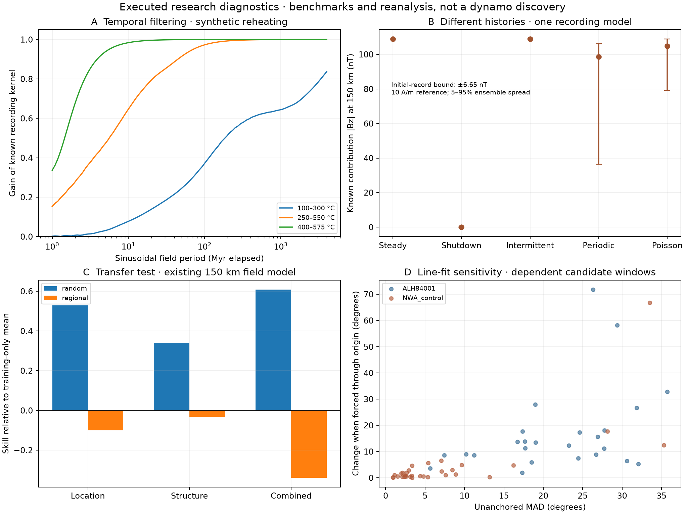

# Executed experiments: recording, detection, regional transfer and laboratory controls

[Open the interactive results](/research/experiments) · [Protocol](experiments/protocol.json) · [Input and output checksums](experiments/manifest.json)

This release implements and runs four connected research diagnostics using original code, the existing permitted numerical products and explicit synthetic inputs. It advances the [dynamo test programme](DYNAMO_TESTS.md) with mathematical benchmarks and data reanalysis. It does not select a Martian dynamo history or establish the origin of the dichotomy.

## What we learned

1. **A recording window can make different histories exactly indistinguishable.** In the reheating example with a 250–550 °C blocking band, steady and intermittent fields produce the same newly acquired record. Both are on throughout the surviving acquisition window. Their behavior outside that window cannot be recovered from this record, even with a perfect instrument. The initial record of 5.6% of the modeled material remains unresolved and is bounded separately.
2. **A relationship fitted to dispersed map points may transfer poorly to other regions.** For the combined model at 150 km and a 2,900 kg/m³ crustal density assumption, predictive skill is about 0.609 for dispersed test points, −0.338 for one regional partition and 0.382 when the partition is rotated by 30°. The regional result is sensitive to the regions withheld. None of these scores identifies the physical cause of magnetization.
3. **A geometrically regular demagnetization line is insufficient evidence of ancient origin.** In the known-contaminated NWA paired-stone dataset, 19 of 32 fitted candidate windows have MAD below 5°. These overlapping windows are not independent observations. The result illustrates a failure of “small line scatter means ancient record”, not a contamination classifier for other specimens.

All numbers above are outputs of this project’s declared calculations. The first is synthetic; the second concerns existing derived map products; the third is an original sensitivity analysis of existing laboratory measurements. Their evidence levels must not be pooled as equivalent observations of Mars.



The figure uses one reference map partition and one illustrative recording band. The interactive page and exports retain the alternative choices. [PNG](experiments/research_experiments.png) · [SVG](experiments/research_experiments.svg)

## 1. Thermal histories become acquisition kernels

The existing conductive solver is rerun at its full integration resolution. Display-thinned thermal arrays are not used for analysis. Pre-pulse temperatures are retained before each instantaneous heating jump.

For each of ten 1 km layers centered between 20 and 30 km depth, assume a uniform distribution of blocking thresholds over one of three illustrative bands: 100–300, 250–550 or 400–575 °C. These are numerical endmembers, **not measured blocking spectra or identified mineral carriers**. The upper band remains below the existing illustrative magnetite ordering temperature. The model represents instantaneous thermal resetting and acquisition, with no grain relaxation, reaction chemistry, pressure, evolving mineral abundance or multidirectional magnetization.

A carrier records the field at its last downward crossing of its threshold. A later upward crossing resets the earlier record. Three fractions are retained explicitly:

- **Known new record:** at least one surviving cooling crossing occurs within the supplied history.
- **Initial record unresolved:** the threshold was never reached; the earlier record is unknown.
- **Still unblocked:** the final temperature is at or above the threshold.

These fractions sum to one. Unknown initial remanence is not silently treated as a measured zero. Its contribution is bounded using an explicit assumed amplitude limit equal to the reference 10 A/m; different limits would change that bound.

### Exact integration and a signal-processing parallel

For each cooling segment, a threshold survives only if it exceeds the maximum subsequent temperature. The overlap of this surviving interval with the blocking band yields a constant acquisition density over a time interval. Integrating each piecewise-constant field history over those intervals gives the signed newly recorded fraction:

```text
m_known(z) = integral K_z(t) b(t) dt
```

The kernel integrates to the known-acquired fraction, not automatically to one. Periodic fields use an analytic triangular antiderivative; stochastic reversal histories use an integrated step function with seeded exponential waiting times. No sampled reversal can slip between integration points. A separate midpoint-threshold approximation is retained as a numerical cross-check, not as the production method.

The analogy with signal processing is exact within this linear model: the Fourier response of the acquisition kernel shows which sinusoidal variations survive temporal averaging. For a uniform time window, the magnitude reduces to the analytic sinc response. The kernel is history dependent and can have several windows; it should not be replaced by a universal cooling-time rule.

### Histories actually compared

- A steady unit field and a field absent throughout the supplied history.
- Permanent shutdown at 500 Myr elapsed.
- Intermittent activity during 0–300 and 900–1,200 Myr elapsed.
- Periodic reversals with chron durations of 5, 20 and 100 Myr.
- Poisson reversals with those mean chron durations.

Each reversing configuration has 32 declared phase or seeded history realizations. The same histories are reused across blocking and thermal choices to make comparisons controlled. The resulting **1,176 configuration-realizations are not independent evidence about Mars**. Time is elapsed since the initial model state, not age before present; “20 Myr chron” is not a measured Martian reversal interval.

[Every realization](experiments/recording_ensemble.csv) · [Recording results and numerical checks](experiments/recording.json)

### What the thermal comparison changes

With progressive cooling and a 100–300 °C band, periodic 20 Myr chrons almost cancel the known signal. With reheating and a 400–575 °C band, most acquisition occurs in a much shorter interval and many histories retain a large coherent record. Neither a weak nor a strong signal uniquely determines a reversal rate without a constrained acquisition kernel. The high-temperature cooling-only case has almost entirely unresolved initial remanence and is particularly unsuitable for interpreting the known contribution as the total signal.

The physical motivation connects to published basin-cooling/reversal models, but the present geometry, thermal history and relay assumptions are our own synthetic benchmark, not a reproduction of those models. [Steele et al. (2024), selected primary sections](https://pmc.ncbi.nlm.nih.gov/articles/PMC11316139/)

## 2. Magnetic fields, detection and parameter ambiguity

### An explicit finite source

The signed layer magnetizations are placed in a vertically magnetized flat cylinder of 150 km radius, with boundaries at 20 and 30 km depth. The reference fully recorded amplitude is 10 A/m. No conversion from an ancient dynamo field in microteslas has been calibrated.

The exact on-axis field contribution of a layer is

```text
Bz(h) = (mu0 M / 2) [ (h + bottom)/sqrt((h + bottom)^2 + R^2)
                    - (h + top)   /sqrt((h + top)^2    + R^2) ]
```

Use consistent length units and multiply teslas by 10^9 for nT. Positive magnetization and field point upwards. Layer contributions are summed with their signs before taking magnitudes. The analytic expression is verified against an independent surface-ring integral, additive layer subdivision, the far-field dipole limit and the infinite-radius limit.

This is a controlled finite source and an on-axis observation model. It is not a global spherical basin model and does not fit the observed Martian magnetic maps. Four heights—10, 50, 150 and 400 km—are evaluated with the same geometry. A separate spherical-harmonic benchmark evaluates `(R/(R+h))^(l+2)` for a single magnetic degree in a current-free exterior. It illustrates altitude filtering but is not multiplied into the cylinder calculation. [SHTOOLS magnetic-potential convention](https://shtools.github.io/SHTOOLS/mag_spectrum.html)

### Injection and recovery

A fixed known-template detector is tested against an analytic two-sided Gaussian detection probability. The false-alarm probability is 1%; each of seven signal-to-noise levels has 8,192 injected trials. Monte Carlo uncertainty is reported separately from the analytic probability. For a zero-signal case, the displayed probability is the configured false-alarm rate of a fixed detector; no template is inferred from a zero vector.

For the illustrative four-height histories, measurement noise is assumed independent with σ = 5 nT per height. This is an explicitly chosen benchmark, not a published instrument uncertainty. The known-template assumption is optimistic: searching over unknown geometries, correlated noise and template mismatch would change detection performance. The two heights in the existing map atlas are outputs from the same field model and must **not** be treated as independent realizations of this artificial noise model.

### Detectable is not identifiable

Fit a free signed amplitude to a steady-field prediction and measure the residual norm in units of the assumed noise. This allows both an unknown strength and polarity. Many histories are detectable under their own ideal template but have similar four-height patterns after amplitude is adjusted. This is a conditional ambiguity between history and source amplitude in the chosen thin-cylinder geometry; it is not a general proof that spatial magnetic data cannot distinguish histories.

Unknown initial remanence is excluded from the conditional detector comparisons and its separate bound remains visible. A full inference must marginalize or constrain that contribution, mineral abundance, field direction, lateral geometry and noise covariance. A low residual is not a probability that the steady history is true.

## 3. Transfer tests on the existing map products

The permitted atlas combines the Langlais magnetic model, MOLA relief, crustal-thickness variants and USGS surface geology. The analysis retains 13,680 two-degree grid centers within |latitude| ≤ 75° with finite common support. Area weights are proportional to cosine latitude. Grid centers are not independent measurement locations.

The target is `log(1 + |B| / 1 nT)` at 150 or 400 km. Four crustal-density variants (2,600–2,900 kg/m³) preserve existing model uncertainty choices. Fixed models are:

| Model | Predictors |
|---|---|
| Mean | Training-only weighted mean |
| Location | Smooth degree-one and degree-two Cartesian functions on a sphere |
| Structure | Relief, crust thickness, their squares and interaction, and geological-unit indicators |
| Combined | Both feature sets |

Weighted centering/scaling use training data only. Features constant or absent in training cannot acquire a coefficient. Ridge penalty is fixed at 0.01 relative to mean weighted squared loss. There is no hyperparameter search, post-hoc best-model selection, geological probability or causal regression interpretation.

Six-fold random-point validation measures interpolation among dispersed cells. Regional validation withholds complete 60° longitude wedges and excludes another 10° of adjacent training longitude on each side. The experiment is repeated with the wedge boundaries rotated by 30°. This buffer is angular, not a constant surface distance; it shrinks toward the latitude limit and does not guarantee independence. Regional holdout can also force extrapolation, which is part of the transfer question.

The methodological parallel comes from validation of spatial ecological models: a validation split should match the prediction task, and blocked splits can require extrapolation. This project implements its own splits and estimator and imports no ecological model or package code. [Roberts et al. (2017), author’s methodological summary](https://florianhartig.github.io/publications/roberts2017cross/)

The score is `1 − weighted out-of-fold MSE / weighted out-of-fold MSE of the training mean`. It can be negative. Four models, two heights, four density variants and three splits yield **96 declared validation settings**. Their dependencies preclude counting them as independent confirmations.

Longitude shifts of the target by 60°, 120° and 180° provide six additional spatial alignment controls across the two heights, with density fixed at 2,900 kg/m³ and the unrotated regional split. They preserve latitude structure but do not form an exchangeable null distribution, so no permutation p-value is reported.

**Inference permitted:** the tested feature relationships do not robustly transfer across all declared partitions. **Inference not established:** crustal thickness, hydrothermal activity or any dynamo mechanism causes the observed contrast. The models are deliberately modest fixed baselines, and the target is a derived magnetic model rather than held-out spacecraft tracks.

[All map settings](experiments/map_validation.csv) · [Fold sizes, range extrapolation and one held-out residual map](experiments/maps.json)

## 4. Laboratory sensitivity and a chronology ledger

The existing CC BY 4.0 MagIC extracts contain ALH 84001 measurements and a separately published NWA paired-stone contamination suite. Raw experiment labels separate natural-remanence demagnetization from laboratory ARM/TRM acquisition. Two ALH specimens (10f and 10i) have laboratory-only measurements in this extract and are excluded from candidate fits.

Repeated treatment levels are averaged as Cartesian vectors before analysis. Retaining the last repeat provides an alternative aggregation check. The fixed AF windows are 10–40, 20–60 and 40–100 mT; fixed thermal windows are 200–300, 250–340 and 275–350 °C. At least five distinct treatment levels are required. No automatic window search maximizes line quality.

Each valid window receives an unanchored principal-component line fit and three comparisons:

- Forcing the line through the origin.
- Leaving out one distinct treatment level at a time.
- Retaining the last repeat instead of averaging repeat vectors.

The maximum angular deviation (MAD) comes from the ratio of transverse to leading variance; it is a collinearity index, not a confidence interval. Comparisons use unsigned axis angles to avoid an arbitrary SVD sign becoming a false direction change. Reported signed fit directions follow the first-minus-last treatment-vector convention and remain in the specimen’s archived coordinate frame. [Kirschvink (1980), primary method summary](https://doi.org/10.1111/j.1365-246X.1980.tb02601.x)

The result is **63 candidate windows, 57 valid numerical fits and six with insufficient distinct treatments**. Twenty-five fits are from ALH; 32 are from the control suite. Their windows overlap and parent samples recur. Small scatter in contaminated specimens demonstrates why geometry alone cannot establish an ancient field. [Control measurements](https://earthref.org/MagIC/19658) · [Source interpretation](https://doi.org/10.1029/2022JE007464)

The ledger preserves specimen, parent sample, individual measurement identifiers in the JSON, treatment range, numerical sensitivity, source terms and a **null acquisition age**. No automated fit is assigned a geological age or global-field origin.

For ALH 84001, selected primary sections now establish the carrier and age-association context. Chromite–sulfide assemblages and geological event bounds motivate a component-level audit, but are not direct dates for these fixed candidate windows. The authors discuss reversal, rotation and alternative histories. Our windows do not reproduce their selected components; their supplements and component-specific statistical choices still require a full audit. No cross-specimen directional clustering, new reversal test or paleointensity calibration is claimed. [Steele et al. (2023), primary institutional copy](https://spiral.imperial.ac.uk/server/api/core/bitstreams/ae29893f-8e81-488f-a416-2b350baf06f7/content)

[Candidate ledger](experiments/component_ledger.csv) · [Full sensitivity results and measurement lineage](experiments/laboratory.json) · [ALH source measurements](https://earthref.org/MagIC/19859)

## What happens to the other data?

Using more data is useful when the join has a defensible meaning. The source audit below records why some existing products enter calculations and others remain context.

| Existing product | Use in this release | What prevents a broader test |
|---|---|---|
| Full synthetic thermal histories | Rerun and connected to acquisition | No regionally calibrated initial state or grain model |
| Relief, crustal thickness, surface geology, magnetic atlas | Predictive transfer and spatial controls | Common resolution, dependent model variants, no raw-track validation |
| ALH MagIC measurements | Candidate-window ledger and sensitivity | Component-specific ages, calibration and shared orientation remain incomplete |
| NWA MagIC measurements | Known-contaminated method control | Cannot generalize handling history to every paired specimen |
| MIL 03346 exports | Retained as a separate comparison lead | Export moment/treatment units need verification before SI pooling |
| Regional crater pilot | Context for partition/reference sensitivity | Literature-selected dependent regions; no matched ancient histories |
| Mineral-detection occupancy | Context only | No survey/exposure mask; blank cells are not unaltered controls; new MOCAAS imports remain restricted |
| Meteorite paleointensity compilation | Age/uncertainty context | Mixed error conventions, bounds and geological associations prevent a pooled Gaussian fit |
| Candidate meteorite source craters | Context only | Source locations are proposed, not established geographic sample coordinates |
| Present equivalent source depths and thermal endpoints | Context only | They do not directly reconstruct ancient acquisition or layer thickness |
| Seismic and tidal interior constraints | Published context | A coupled interior evolution model is still needed |

No old internship material, MCD call, new restricted dataset or external analysis code is used. Existing data retain their source-specific terms in the [manifest](experiments/manifest.json) and [data provenance](data/manifest.json). The new numerical outputs and plots occupy roughly 1.4 MB; no research archive was downloaded.

## Verification and remaining work

Analytic checks cover cooling crossings and reset bookkeeping, the boxcar/sinc limit, exactly balanced reversals, constant/absent fields, the cylinder integral and asymptotes, single-degree radial attenuation, and the Gaussian false-alarm limit. Additional checks verify complete buffered folds, training-only scaling, known PCA lines and origin bias, and input/output hashes.

Production acquisition uses exact interval integration. Doubling thermal spatial/time resolution is evaluated at 16 phases for each of the three periodic chron durations; the recorded maximum discrepancies are numerical diagnostics, not geological uncertainty. The deliberately separate 1,024-threshold approximation can differ noticeably during rapid reversals, which is why it is not used for the reported predictions.

The next physically informative extensions are measured blocking/relaxation constraints, lateral basin geometry and vector fields, realistic correlated noise with raw-track or independent observations, and a component-specific ALH age/orientation audit. Core-energy and magnetohydrodynamic hypotheses remain outside this first implementation. A useful research conclusion may be a quantified ambiguity or a requirement for a different measurement; it need not be a new origin scenario.

To reproduce the calculations offline:

```bash
python scripts/experiments/build.py
python scripts/research/render_docs.py
python scripts/research/render_dynamo.py
python -m pytest -q -m 'not integration'
node --test tests/comparison.test.mjs
```

The manifest records all numerical inputs, implementation/test hashes, output hashes and runtime versions. Original implementations are in `src/marswind/recording.py` and `src/marswind/research_checks.py`; the build script fixes the protocols, seeds, figures and exports. Software tests verify the declared computations; they do not validate an ancient Martian dynamo history.
