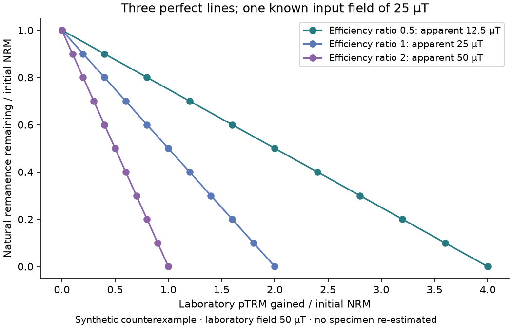

# Read the rock before inferring the ancient field

A short learning path tied to this project's actual controls. [Open the interactive example](DICHOTOMY_PHYSICS.md?view=paleomagnetism) · [Three physical studies](DICHOTOMY_PHYSICS.md).

The central question is not simply whether a rock is magnetic. It is **which process made each component, when that happened, and how its response relates to the field we want to infer**. Direction, strength and acquisition age require different evidence.

## 1. Identify the quantity and the recording process

The foundational reference is [Tauxe et al., Essentials of Paleomagnetism](https://earthref.org/MagIC/books/Tauxe/Essentials/), especially chapters 4, 7, 9 and 10. Read those sections alongside the following vocabulary:

| Term | Meaning |
| --- | --- |
| B, magnetic flux density | A field, commonly expressed here in nT or µT. |
| Magnetic moment | A specimen-scale quantity, in A m²; not a field strength. |
| Magnetization | Moment per volume, in A/m. Volume or other normalization must be known. |
| NRM | Natural remanent magnetization as initially measured; it may contain several components. |
| TRM | Remanence acquired during cooling in a field. |
| CRM | Remanence acquired during chemical mineral growth or change. |
| VRM | Time-dependent remanence acquired while material resides in a field. |
| IRM | Remanence acquired through an applied field, potentially including handling contamination. |

Induced magnetization depends on a present field; remanence persists after removal. Shock can also modify a record. These processes cannot be substituted for one another merely because vectors align. Blocking depends on time, temperature and grain properties; an ordering temperature is not a universal blocking temperature. [Tauxe et al.](https://earthref.org/MagIC/books/Tauxe/Essentials/)

**Project exercise:** a file contains a vector amplitude but no unit or specimen volume. Can it supply an absolute ancient field? **No.** First establish what was measured and how it was normalized. Our MIL 03346 RockPy material remains a relative-amplitude diagnostic, not a field estimate.

## 2. Separate components before assigning an age

Demagnetization progressively changes the measured vector. A fitted line can describe one segment; a plane can describe another geometry. Component analysis is associated with [Kirschvink (1980)](https://doi.org/10.1111/j.1365-246X.1980.tb02601.x). Our existing SVD implementation reports angular scatter through MAD. **MAD is not a confidence interval on the ancient field and does not establish antiquity.** We accessed the publisher's summary in this pass, not the full methodological paper.

In our already executed contaminated NWA control, 19 of 32 candidate fits have MAD below 5°. They overlap and are not 32 independent specimens. The published [hand-magnet study](https://doi.org/10.1029/2022JE007464) is why these data are a contamination control, not evidence for 19 ancient fields. [Inspect the actual fits](EXECUTED_EXPERIMENTS.md?view=laboratory).

**Project exercise:** selecting the straightest segment produces a small MAD. What has improved? The geometric description of that selected segment. What is still missing? Evidence for its acquisition process, age, specimen orientation and independence from later overprints. A sample-coordinate direction cannot be promoted to a Martian geographic direction without an orientation history.

## 3. Understand what an Arai slope assumes

An ideal Thellier-type comparison plots natural remanence remaining against laboratory partial TRM gained during paired heating steps. If natural and laboratory responses are equivalent and proportional to field, an ideal straight slope b gives Banc = −b Blab. Real protocols require controls; linearity alone is insufficient. [Paterson et al. (2014)](https://doi.org/10.1002/2013GC005135)

We wrote a deliberately exact counterexample. The input ancient field is 25 µT and laboratory field 50 µT. Let r be natural recording efficiency divided by laboratory recording efficiency and f the replaced fraction. Define:

```text
x = f Blab / (r Btrue)
y = 1 − f
b = −r Btrue / Blab
uncorrected apparent field = −b Blab = r Btrue
```

| Efficiency ratio r | True input field | Apparent field from slope | Is the line perfectly straight? |
| --- | ---: | ---: | --- |
| 0.5 | 25 µT | 12.5 µT | Yes |
| 1 | 25 µT | 25 µT | Yes |
| 2 | 25 µT | 50 µT | Yes |



These curves are original synthetic controls, not observations and not a physical simulation of a particular alteration process. The ratio has been prescribed, not estimated from a mineral. We do not claim that any single laboratory check would detect all three cases.

**Project exercise:** adding more exact points to the wrong-efficiency line reduces fitting scatter. Does it recover the true field? **No.** It adds precision to a biased conversion. That is why a regression score is not a replacement for recording physics.

## 4. Match each inference to its controls

[Paterson et al. (2014)](https://doi.org/10.1002/2013GC005135) assess paleointensity selection with independently constrained material. Their work motivates checking acceptance rules against independent controls rather than tuning cutoffs until desired results pass. [Biggin & Paterson (2014)](https://doi.org/10.3389/feart.2014.00024) separate reliability issues including acquisition age, alteration, domain behavior, anisotropy and cooling. We use that separation as a checklist, not an automatically transferable Earth-to-Mars quality score.

| Proposed project claim | Evidence we would need before making it |
| --- | --- |
| A component is primary | Petrographic and chronological context, repeatable components across appropriate specimens, and tests of plausible later overprints. |
| Heating did not change the recorder | Protocol-specific alteration checks, including repeat partial-TRM checks where applicable, with their actual sensitivity and failures reported. |
| The response is suitable for paleointensity | Domain-behavior and reciprocity evidence appropriate to the method; a linear-looking segment alone is inadequate. |
| Laboratory and natural efficiencies are comparable | Appropriate anisotropy, cooling-rate and nonlinearity checks or justified corrections and uncertainty. |
| The reported uncertainty reflects independent material | Specimen and site/ejection-group structure, not every measurement step or overlapping fit counted as a separate sample. |
| A direction constrains location | A defensible reference frame, orientation and subsequent rotation history. |

This table is a project admission rule for future claims. It is not a claim that every listed measurement exists in the assembled meteorite data, nor that meeting a checklist guarantees accuracy.

## 5. Connect retention and age to the geological event

[Nagy et al. (2017)](https://doi.org/10.1073/pnas.1708344114) show why retention cannot be reduced to a single-domain-only rule: suitable vortex-state magnetite can be very stable. Their result is not a license to assign a billion-year lifetime to every grain. Our thermal histories test temperature compatibility; they do not calculate a specimen-specific micromagnetic retention probability.

For each project sample, we must keep the following clocks distinct: crystallization, chemical alteration, shock, acquisition or resetting of the magnetic component, and ejection. A crystallization age does not automatically date every remanent component. A proposed source crater does not restore a lost specimen orientation. The [event timeline](COMPARISON.md?view=timeline) makes these distinctions visible.

**Project exercise:** a modeled rock stays below its selected ordering temperature after an impact. Is its ancient record proved intact? **No.** Grain-scale relaxation, chemical change, shock and earlier history remain unresolved. The model has only passed its stated temperature test.

## 6. Keep local magnetic evidence separate from a planetary dynamo claim

Our [recording experiment](EXECUTED_EXPERIMENTS.md?view=recording) already constructs different input field histories with the same recovered contribution. Our [detection experiment](EXECUTED_EXPERIMENTS.md?view=detection) shows how source geometry and altitude filter a signal. These are project examples of non-uniqueness, not proofs of which history occurred on Mars.

A weak orbital anomaly is therefore not, by itself, a date for dynamo shutdown. A measured meteorite component is also not a direct observation of a planet-wide dipole. A planetary inference needs a spatial and chronological sampling argument, compatible recording processes, and comparisons with alternative field geometries and overprints.

### What each current dataset is allowed to do

| Project material | Current role | Inference not performed |
| --- | --- | --- |
| NWA 7034 pairing-group measurements | Published contamination control; vector-fit sensitivity | Ancient Martian paleointensity |
| MIL 03346 RockPy extract | Relative-amplitude and component diagnostics, with acquisition sequences kept separate | Absolute field from undocumented amplitude units |
| ALH 84001 QDM-derived tables | Inspection of published specimen-level results and their stated interpretation | Independent refit of raw magnetic images or global field reconstruction |
| Curated meteorite literature values | Attributed published constraints with methods, dates and limits | Homogeneous measurements with identical calibration |
| New Arai curves | Known-input test of a conversion assumption | A new observation or an accepted paleointensity estimator |

## A practical sequence for our next real-data analysis

1. Write the claim in advance: component geometry, acquisition age, local field intensity or planetary field history.
2. Select permitted records that actually contain the required measurements. Preserve specimen IDs, treatment order, units, lab field, method codes and handling history.
3. Inspect raw component paths and protocol metadata before defining fit windows. Record excluded steps and reasons. Keep laboratory-added sequences separate from natural remanence.
4. Declare selection rules and sensitivity cases before interpreting a preferred fit. Use known controls and retain failures in the report.
5. Track independent specimens and shared provenance. Propagate calibration and reference-frame uncertainty separately from fit scatter.
6. If a required control is missing, report the narrower supported result. Do not invent a correction or turn “not measured” into “passed.”

This learning path is meant to support reading and transparent analysis, not replace supervised laboratory training or a full paper's methods. The next useful advance is a **specimen-level admission table** linking each proposed claim to available controls and missing metadata, before attempting any new paleointensity estimate.

## Trace and reproduce

[Reading depth and source ledger](physics/sources.json) · [Synthetic input protocol](physics/protocol.json) · [Arai CSV](physics/arai_counterexample.csv) · [Arai SVG](physics/paleointensity_control.svg) · [Run manifest](physics/manifest.json).

`python scripts/physics/build.py` recreates the three curves offline. `python -m pytest -q tests/test_dichotomy_physics.py` verifies that all lines are exact while the inferred fields differ as prescribed. The existing [laboratory controls report](EXECUTED_EXPERIMENTS.md) documents the separate real-data fits.
