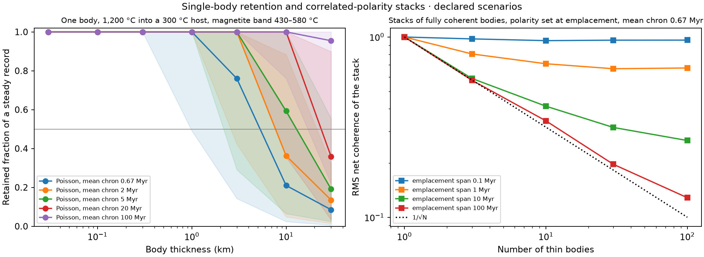

# Rapidly cooled bodies under a reversing dynamo

**Status: declared-scenario calculation completed. Verdict: adds a constraint. Rapid cooling can protect one body; stack cancellation depends on the shared field and emplacement span.** [Protocol](followup/bodies/protocol.json) · [Retention table](followup/bodies/retention.csv) · [Thickness bounds](followup/bodies/thickness_bounds.json) · [Stack table](followup/bodies/stack.csv) · [Manifest](followup/bodies/manifest.json)

## Why

Test 4 found that crust cooling conductively over hundreds of millions of years keeps about 2% of a steady record under randomly timed reversals every 0.67 Myr. The natural escape is a source that cooled within one chron: a sill, dyke or lava unit. This calculation asks how thick such a body can be, and whether many such bodies can add up to a strong coherent source. It is a declared physical scenario, not an inference about a particular Martian region.

## How

An infinite planar slab of thickness h at 1200 °C is emplaced into a host at 100, 300, 400 °C; it cools by conduction with diffusivity 1e-06 m²/s and no latent heat (analytic heat-kernel solution; recording kernels use piecewise-linear temperature interpolation). Each of 32 positions across the half-slab acquires remanence while cooling through a uniform blocking band, 430–580 °C for magnetite and 175–325 °C for pyrrhotite. The body's kernel is integrated against periodic reversals (16 phases) and Poisson reversals (128 seeds) with mean chrons of 0.67, 2, 5, 20, 100 Myr; the retained fraction of a steady record is reported. A stack of N fully coherent bodies emplaced at random times within a span records the field sign at each emplacement (mean chron 0.67 Myr, 400 realizations). The protocol was saved before evaluation; it is a local declaration, not external preregistration.

## Result

### One body

Magnetite band, host at 300 °C, mean chron 0.67 Myr:

| Thickness | Mid-plane cooling through the band (Myr) | Poisson retention, median | Poisson 5–95% | Periodic retention, median |
| --- | ---: | ---: | ---: | ---: |
| 30 m | 8.534e-05 | 100.0% | 100.0–100.0% | 100.00% |
| 100 m | 0.0009482 | 100.0% | 100.0–100.0% | 100.00% |
| 300 m | 0.008534 | 100.0% | 100.0–100.0% | 100.00% |
| 1 km | 0.09482 | 100.0% | 49.1–100.0% | 100.00% |
| 3 km | 0.8534 | 76.0% | 14.3–100.0% | 49.07% |
| 10 km | 9.482 | 21.0% | 2.4–58.6% | 4.99% |
| 30 km | 85.34 | 8.5% | 0.6–19.0% | 0.07% |

Largest declared thickness with median Poisson retention ≥ 50%:

| Band | Host (°C) | Mean chron (Myr) | Largest passing tested thickness |
| --- | ---: | ---: | ---: |
| magnetite 430 580 | 100 | 0.67 | 3 km |
| magnetite 430 580 | 100 | 2 | 10 km |
| magnetite 430 580 | 100 | 5 | 10 km |
| magnetite 430 580 | 100 | 20 | 30 km |
| magnetite 430 580 | 100 | 100 | 30 km |
| magnetite 430 580 | 300 | 0.67 | 3 km |
| magnetite 430 580 | 300 | 2 | 3 km |
| magnetite 430 580 | 300 | 5 | 10 km |
| magnetite 430 580 | 300 | 20 | 10 km |
| magnetite 430 580 | 300 | 100 | 30 km |
| magnetite 430 580 | 400 | 0.67 | 1 km |
| magnetite 430 580 | 400 | 2 | 3 km |
| magnetite 430 580 | 400 | 5 | 3 km |
| magnetite 430 580 | 400 | 20 | 10 km |
| magnetite 430 580 | 400 | 100 | 10 km |
| pyrrhotite 175 325 | 100 | 0.67 | 1 km |
| pyrrhotite 175 325 | 100 | 2 | 3 km |
| pyrrhotite 175 325 | 100 | 5 | 3 km |
| pyrrhotite 175 325 | 100 | 20 | 10 km |
| pyrrhotite 175 325 | 100 | 100 | 10 km |

### A stack of bodies

Mean chron 0.67 Myr, each body fully coherent:

| Bodies | Emplacement span (Myr) | Net coherence, median | Net coherence, RMS | 1/√N |
| ---: | ---: | ---: | ---: | ---: |
| 1.0 | 0.1 | 1.00 | 1.00 | 1.00 |
| 1.0 | 1.0 | 1.00 | 1.00 | 1.00 |
| 1.0 | 10.0 | 1.00 | 1.00 | 1.00 |
| 1.0 | 100.0 | 1.00 | 1.00 | 1.00 |
| 3.0 | 0.1 | 1.00 | 0.98 | 0.58 |
| 3.0 | 1.0 | 1.00 | 0.81 | 0.58 |
| 3.0 | 10.0 | 0.33 | 0.59 | 0.58 |
| 3.0 | 100.0 | 0.33 | 0.58 | 0.58 |
| 10.0 | 0.1 | 1.00 | 0.95 | 0.32 |
| 10.0 | 1.0 | 0.60 | 0.71 | 0.32 |
| 10.0 | 10.0 | 0.20 | 0.41 | 0.32 |
| 10.0 | 100.0 | 0.20 | 0.34 | 0.32 |
| 30.0 | 0.1 | 1.00 | 0.96 | 0.18 |
| 30.0 | 1.0 | 0.60 | 0.67 | 0.18 |
| 30.0 | 10.0 | 0.20 | 0.31 | 0.18 |
| 30.0 | 100.0 | 0.13 | 0.20 | 0.18 |
| 100.0 | 0.1 | 1.00 | 0.96 | 0.10 |
| 100.0 | 1.0 | 0.58 | 0.67 | 0.10 |
| 100.0 | 10.0 | 0.20 | 0.27 | 0.10 |
| 100.0 | 100.0 | 0.08 | 0.13 | 0.10 |



## Reading

The 3 km body in the primary case crosses the mid-plane blocking band in **0.853 Myr**, longer than a 0.67 Myr mean chron, and retains **76%** at the simulated median. The 1 km body crosses in 0.0948 Myr. These are scenario results, not universal thickness cutoffs. Each tabulated thickness limit is the largest **tested** value meeting the median criterion; a passing 30 km case only reaches the top of the tested grid. The continuous threshold and its Monte Carlo uncertainty were not estimated.

The bodies share one telegraph field, so independent emplacement times do not imply independent polarities. For N equal instantaneous recorders distributed uniformly over a span T, let x = 2T/τ, with mean chron τ. The telegraph correlation is derived in the [KTH stochastic-process notes, section 12.5.3](https://www.math.kth.se/matstat/gru/sf2940/lectnotemat5.pdf) (the relevant derivation was consulted; no code or data copied). Directly integrating E[S(t)S(s)] = exp(−2|t−s|/τ) over the two independent uniform emplacement times gives:

```text
A = 2 * (x - 1 + exp(-x)) / x²
RMS² = 1/N + (1 - 1/N)*A
```

The limit 1/√N applies when the correlation term is negligible, approximately **T ≫ Nτ**, not merely T ≫ τ. At fixed span, increasing N leaves a nonzero correlation floor. For N = 100 and τ = 0.67 Myr the analytic RMS is **0.272 at 10 Myr** and **0.129 at 100 Myr**, consistent with the simulation. The corresponding simulated medians are 0.20 and 0.08; RMS and median must not be interchanged. Favorable stochastic histories can retain a record across multiple chrons, so single-chron emplacement is not a necessary condition for every realization.

This is a retention calculation for equal sources, not an orbital-field inversion for a crustal stack. Source geometry, volume, carrier efficiency, emplacement history and reversal history remain coupled. None of these results alone requires a change in the dynamo rate or makes reversal inference the only possible next calculation. The subsequent [synthetic identifiability prerequisite](REVERSAL_IDENTIFIABILITY.md) tests one explicit rate–recording ambiguity before any observed-map inference.

### Corrections following the implementation review

The initial cooling column reported elapsed time from emplacement to a sampled point near the lower band boundary. It now reports the analytic difference between both crossing times; both absolute crossing times are saved in the CSV. Retention kernels and their simulated fractions are unchanged. The stack CSV now includes the exact correlated-field RMS for comparison. The original protocol timestamp is preserved when rebuilding. Earlier files and hashes are retained under `followup/bodies_audit/before/`. The original Carslaw & Jaeger section number has not been independently checked; the formula is verified against the heat-kernel expression and analytic inversion instead.

## Limits

No latent heat, no host cooling with depth, no chemical remanence, no shock, uniform blocking band, infinite slab geometry, no forward field at orbital altitude. The stack model assumes independent random emplacement times and equal bodies, whose polarities are correlated through one shared field. It uses the instantaneous-recording limit; finite cooling and mutual reheating within a stack are not coupled. The thicknesses and chrons are declared scenarios. Ogawa &amp; Manga (2007) and earlier dyke-source models treat related geometries; their results were not reproduced and no novelty is claimed.

## Reproduce

```bash
python scripts/followup/rapid_bodies.py
python -m pytest -q tests/test_rapid_bodies.py
python scripts/research/render_docs.py
```
