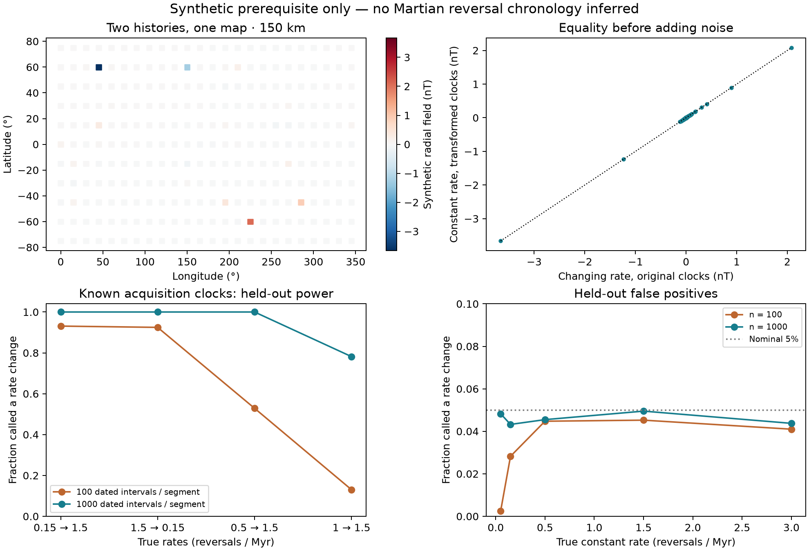

# Reversal histories and acquisition clocks

**Synthetic prerequisite · 28 September 2026.** The declared flexible recording model fails global identifiability: distinct reversal histories can produce the same source moments and orbital observations. A separate positive control succeeds when acquisition times are known. No observed Mars magnetic map is fitted, and no transition age or preferred dynamo history is inferred.

## Why

[Slow cooling](DISCRIMINATING_TESTS.md) and [rapid bodies](RAPID_BODIES.md) show that reversal statistics and recording duration jointly determine cancellation. Before interpreting a coherent magnetic patch as a long chron, we must test whether recording histories can mimic a rate change. The earlier [proposal](NEXT_TEST_PROTOCOLS.md) required this gate before any map interpretation. The [machine protocol](followup/reversal/protocol.json) was saved before these numerical trials; the analytic time-change argument and the preceding body results were already known. This is an internal protocol, not an external preregistration.

## How

We compare rates of 0.15 then 1.5 reversals/Myr, changing at elapsed time 100 Myr, with a constant 1.5 reversals/Myr. Both families permit the same nuisance class: positive piecewise-affine acquisition clocks with slopes 0.1–10, moment scales 0.5–2 and activity windows transformed with the clock. The main example uses unit moment scale and a continuously active window. Geometry is fixed between the two descriptions.

Let H(t) be integrated reversal rate and set u(t) = H(t)/1.5. Unit-rate Poisson arrivals in H generate one shared path. The constant-rate path at u(t) has exactly the same sign as the changing-rate path at t. Moving each acquisition interval to the u clock and preserving its mass therefore gives **the same signed remanence for every realization**. Intervals crossing the rate break are split before transformation. The field's active window is transformed too: 0–200 Myr becomes 0–110 Myr. This is a comparison of distinct physical histories when absolute acquisition ages and the activity duration are unknown, not a change of coordinates with externally fixed dates silently discarded.

The construction is a direct application of the established time-rescaling property of Poisson processes; see [Brown et al. (2002), author-hosted manuscript](https://www.stat.cmu.edu/~kass/papers/rescaling.pdf), introduction and theorem. The implementation and acquisition-integral derivation here are original. We use a finite-horizon coupling, not a goodness-of-fit test on censored interarrival times. No novelty is claimed.

The numerical check uses 24 bodies with slab acquisition kernels (1, 3 or 10 km effective thickness; 300 °C host; 430–580 °C blocking band), 128 shared field realizations, and 264 radial observations at each of 150 and 400 km. Within the early segment, shrinking time by 0.1 is also the conductive time scale of a slab thinner by √0.1: 3 km becomes 0.949 km. Each example kernel lies wholly within one segment. The orbital operator consists of z-directed point dipoles at 20 km depth, with 10¹⁴ A m² reference moments. It is a linear synthetic basis: thermal thickness, finite source geometry, density and moment are **not** jointly constrained by a physical body inversion.

## Result

Across all 128 realizations, the largest signed-record difference is 1.13e-12. The largest relative map difference is 1.79e-13; the largest absolute difference is 2.60e-13 nT. This passes the declared equality tolerance of 10⁻¹⁰. Adding the same 0, 1 or 5 nT Gaussian noise to each equivalent pair preserves equality of their observation laws. Shared noise is a coupling demonstration; it does not claim that two independent noisy observations would be pixel-identical. These noise levels are scenarios, not Langlais coefficient uncertainties.



### Positive control: independently known acquisition times

We simulate instantaneous, noiseless polarity samples at a known 0.1 Myr spacing, in two segments whose boundary is known. The sign-change probability is p = (1 − exp(−2λΔt))/2, allowing unobserved even numbers of reversals. A binomial likelihood fits either one shared rate or two rates, with the same probability bounds. The cutoff is calibrated using 4,000 simulations at each of five null rates, taking the largest 95th percentile; classification uses a strict exceedance. Separate seeds supply 4,000 held-out trials per case.

| Intervals per segment | True rates, /Myr | Held-out detection | Median fitted early / late rate |
|---:|---:|---:|---:|
| 100 | 0.15 → 1.5 | 93.1% | 0.101 / 1.506 |
| 100 | 1.5 → 0.15 | 92.5% | 1.506 / 0.101 |
| 100 | 0.5 → 1.5 | 52.9% | 0.527 / 1.506 |
| 100 | 1 → 1.5 | 13.1% | 0.992 / 1.506 |
| 1000 | 0.15 → 1.5 | 100.0% | 0.152 / 1.492 |
| 1000 | 1.5 → 0.15 | 100.0% | 1.506 / 0.142 |
| 1000 | 0.5 → 1.5 | 100.0% | 0.494 / 1.492 |
| 1000 | 1 → 1.5 | 78.2% | 1.004 / 1.506 |

For the declared primary case (1,000 intervals per segment, 0.15 → 1.5/Myr), power is **100.0%**, and the largest held-out false-positive fraction over the null grid is **5.0%**. The positive control passes its rule. These are simulation frequencies under ideal dated sampling, not performance estimates for available Mars maps. Sampling uncertainty for a 5% frequency with 4,000 trials is about 0.35 percentage points (one standard error).

### Releasing the clock restores the ambiguity

The dated-sign likelihood depends on λΔt. A constant rate of 1.5/Myr sampled with early spacing 0.01 Myr and late spacing 0.1 Myr has exactly the same probabilities as the primary changing-rate case sampled at 0.1 Myr throughout. We also profile the held-out primary counts: allowing each spacing to lie in 0.01–1 Myr, a common-rate ridge attains the two-rate maximum likelihood in **4000 of 4000 trials**. The [profile table](followup/reversal/unknown_clock_profile.csv) records rates, spacings and both likelihoods. A row outside the feasible ridge would be marked unresolved by this analytic profiling step. No arbitrary classifier is assigned a chance-level score.

## Verdict

**The gate to observed-map inference is closed for this nuisance class.** A counterexample disproves global uniqueness in that class, even before orbital smoothing or noise. Fitting correlation lengths or connected-sign areas cannot distinguish this pair: the entire synthetic fields agree. This does not show that all rate changes are indistinguishable in every physical model, or that existing public evidence can never help.

The dated positive control shows what removes this particular degeneracy: acquisition times constrained independently of the magnetic fit. Source ages, cooling rates, geometry, material budgets and independently fixed dynamo activity windows can restrict admissible time changes. A more restrictive coupled physical model would need its own declared recovery test. The original broader programme's observed-map stage and any transition dating are not executed.

## Limits

- The example allows flexible piecewise recording clocks; the result is conditional on that class. The simple conductive rescaling within each segment does not establish a physically admissible three-dimensional Martian crust with all other observations matched.
- Dipole geometry, common global-z orientation and reference moments are synthetic. No geologic-age map, measured correlation length, Langlais coefficient uncertainty or real source-direction inversion enters this calculation.
- The positive control knows the break, has perfectly dated instantaneous signs, and assumes Poisson increments. Uncertain ages, overlapping acquisition, unknown change dates and non-Poisson reversals require additional tests.
- The reported Monte Carlo trials verify the implementation; the pathwise change-of-time identity is the reason the equivalence holds. Model ambiguity is not evidence for either actual Mars history.

## Reproduce

```sh
python scripts/followup/reversal_identifiability.py
python -m pytest -q tests/test_reversal_identifiability.py
python scripts/research/render_docs.py
python scripts/research/render_site.py
```

The builder checks the frozen input hashes and never rewrites the protocol. [Source ledger](followup/reversal/sources.json), [source geometries](followup/reversal/sources.csv), [record checks](followup/reversal/record_checks.csv), [map checks](followup/reversal/map_checks.csv), [classification and rate recovery](followup/reversal/classification.csv), [calibration](followup/reversal/calibration.csv), [all trial counts](followup/reversal/trial_counts.npz), [summary](followup/reversal/summary.json) and [manifest](followup/reversal/manifest.json) are saved. No new external dataset or implementation was incorporated.
