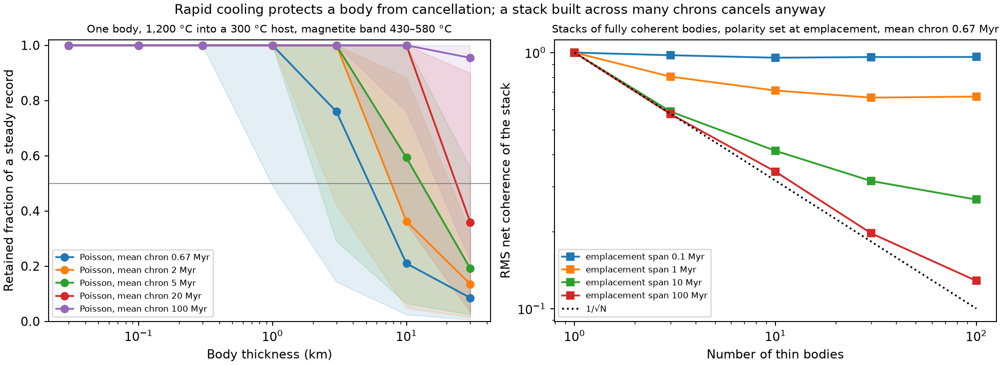

# Rapidly cooled bodies under a reversing dynamo

**Status: declared-scenario calculation completed. Verdict: adds a constraint. Rapid cooling protects a single body from cancellation; a stack assembled over many chrons cancels anyway.** [Protocol](followup/bodies/protocol.json) · [Retention table](followup/bodies/retention.csv) · [Thickness bounds](followup/bodies/thickness_bounds.json) · [Stack table](followup/bodies/stack.csv) · [Manifest](followup/bodies/manifest.json)

## Why

Test 4 found that crust cooling conductively over hundreds of millions of years keeps about 2% of a steady record under randomly timed reversals every 0.67 Myr. The natural escape is a source that cooled within one chron: a sill, dyke or lava unit. This calculation asks how thick such a body can be, and whether many such bodies can add up to a strong coherent source. It is a declared physical scenario, not an inference about a particular Martian region.

## How

An infinite slab of thickness h at 1200 °C is emplaced into a host at 100, 300, 400 °C; it cools by conduction with diffusivity 1e-06 m²/s and no latent heat (exact solution, Carslaw &amp; Jaeger 1959). Each of 32 positions across the half-slab acquires remanence while cooling through a uniform blocking band, 430–580 °C for magnetite and 175–325 °C for pyrrhotite. The body's kernel is integrated against periodic reversals (16 phases) and Poisson reversals (128 seeds) with mean chrons of 0.67, 2, 5, 20, 100 Myr; the retained fraction of a steady record is reported. A stack of N fully coherent bodies emplaced at random times within a span records the field sign at each emplacement (mean chron 0.67 Myr, 400 realizations). The protocol was saved before evaluation; it is a local declaration, not external preregistration.

## Result

### One body

Magnetite band, host at 300 °C, mean chron 0.67 Myr:

| Thickness | Mid-plane cooling through the band (Myr) | Poisson retention, median | Poisson 5–95% | Periodic retention, median |
| --- | ---: | ---: | ---: | ---: |
| 30 m | 0.0001051 | 100.0% | 100.0–100.0% | 100.00% |
| 100 m | 0.001168 | 100.0% | 100.0–100.0% | 100.00% |
| 300 m | 0.01051 | 100.0% | 100.0–100.0% | 100.00% |
| 1 km | 0.1168 | 100.0% | 49.1–100.0% | 100.00% |
| 3 km | 1.051 | 76.0% | 14.3–100.0% | 49.07% |
| 10 km | 11.68 | 21.0% | 2.4–58.6% | 4.99% |
| 30 km | 105.1 | 8.5% | 0.6–19.0% | 0.07% |

Largest declared thickness with median Poisson retention ≥ 50%:

| Band | Host (°C) | Mean chron (Myr) | Maximum thickness |
| --- | ---: | ---: | ---: |
| magnetite 430 580 | 100 | 0.67 | 3 km |
| magnetite 430 580 | 100 | 2 | 10 km |
| magnetite 430 580 | 100 | 5 | 10 km |
| magnetite 430 580 | 100 | 20 | 30 km |
| magnetite 430 580 | 100 | 100 | 30 km |
| magnetite 430 580 | 300 | 0.67 | 3 km |
| magnetite 430 580 | 300 | 2 | 3 km |
| magnetite 430 580 | 300 | 5 | 10 km |
| magnetite 430 580 | 300 | 20 | 10 km |
| magnetite 430 580 | 300 | 100 | 30 km |
| magnetite 430 580 | 400 | 0.67 | 1 km |
| magnetite 430 580 | 400 | 2 | 3 km |
| magnetite 430 580 | 400 | 5 | 3 km |
| magnetite 430 580 | 400 | 20 | 10 km |
| magnetite 430 580 | 400 | 100 | 10 km |
| pyrrhotite 175 325 | 100 | 0.67 | 1 km |
| pyrrhotite 175 325 | 100 | 2 | 3 km |
| pyrrhotite 175 325 | 100 | 5 | 3 km |
| pyrrhotite 175 325 | 100 | 20 | 10 km |
| pyrrhotite 175 325 | 100 | 100 | 10 km |

### A stack of bodies

Mean chron 0.67 Myr, each body fully coherent:

| Bodies | Emplacement span (Myr) | Net coherence, median | Net coherence, RMS | 1/√N |
| ---: | ---: | ---: | ---: | ---: |
| 1 | 0.1 | 1.00 | 1.00 | 1.00 |
| 1 | 1 | 1.00 | 1.00 | 1.00 |
| 1 | 10 | 1.00 | 1.00 | 1.00 |
| 1 | 100 | 1.00 | 1.00 | 1.00 |
| 3 | 0.1 | 1.00 | 0.98 | 0.58 |
| 3 | 1 | 1.00 | 0.81 | 0.58 |
| 3 | 10 | 0.33 | 0.59 | 0.58 |
| 3 | 100 | 0.33 | 0.58 | 0.58 |
| 10 | 0.1 | 1.00 | 0.95 | 0.32 |
| 10 | 1 | 0.60 | 0.71 | 0.32 |
| 10 | 10 | 0.20 | 0.41 | 0.32 |
| 10 | 100 | 0.20 | 0.34 | 0.32 |
| 30 | 0.1 | 1.00 | 0.96 | 0.18 |
| 30 | 1 | 0.60 | 0.67 | 0.18 |
| 30 | 10 | 0.20 | 0.31 | 0.18 |
| 30 | 100 | 0.13 | 0.20 | 0.18 |
| 100 | 0.1 | 1.00 | 0.96 | 0.10 |
| 100 | 1 | 0.58 | 0.67 | 0.10 |
| 100 | 10 | 0.20 | 0.27 | 0.10 |
| 100 | 100 | 0.08 | 0.13 | 0.10 |



## Reading

Cooling time scales with the square of thickness, so a body a few kilometres thick cools through its blocking band in well under a chron of 0.67 Myr and keeps almost all of its record, while a body of ten kilometres or more approaches the conductive-crust regime of Test 4. Rapid cooling is therefore a real escape from cancellation, but only body by body. When a magnetized crust is built from many bodies emplaced over an interval longer than a chron, their polarities are set by the field at each emplacement and the stack cancels like 1/√N: a hundred sills emplaced under a dynamo reversing every 0.67 Myr retain (RMS) about a quarter of their summed magnetization when built over 10 Myr and about an eighth over 100 Myr, because emplacements closer than a chron share a polarity. A stack is coherent only if it was emplaced within a single chron or under a long-lived polarity.

The tension of Test 4 is thus sharpened rather than resolved. Under a frequently reversing dynamo, a strong coherent source over tens of kilometres of crust requires either emplacement of most of its volume within one chron, or a period of stable polarity long enough to cover its construction, or a magnetization per body so high that a tenth of it still meets the budget of Test 3. Each of these is a statement about the dynamo's reversal history at the time the southern crust was built, which is what the follow-up on reversal statistics (protocol 1) would have to address.

## Limits

No latent heat, no host cooling with depth, no chemical remanence, no shock, uniform blocking band, infinite slab geometry, no forward field at orbital altitude. The stack model assumes independent random emplacement times and equal bodies. The thicknesses and chrons are declared scenarios. Ogawa &amp; Manga (2007) and earlier dyke-source models treat related geometries; their results were not reproduced and no novelty is claimed.

## Reproduce

```bash
python scripts/followup/rapid_bodies.py
python -m pytest -q tests/test_rapid_bodies.py
python scripts/research/render_docs.py
```
